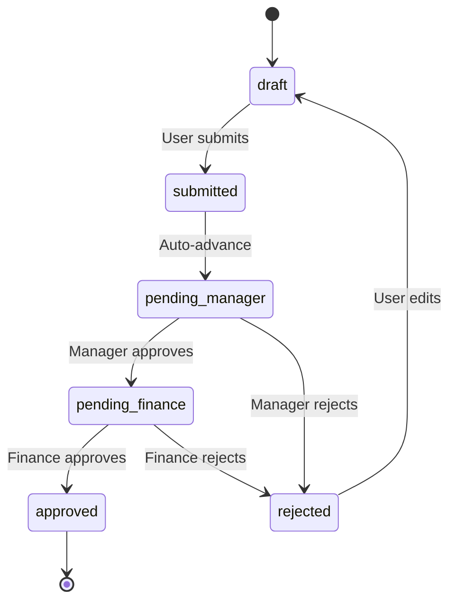

# Hourglass Documentation Hub

**Last Updated:** 2026-04-24  
**System Version:** v2.0 (Hexagonal Architecture)

Welcome to the Hourglass documentation! This is your central reference for understanding and developing the time entry and expense tracking system.

---

## 📚 Documentation Structure

### 01-Features (User-Facing Capabilities)
Documentation of features from a user perspective, including workflows and acceptance criteria.

| Code | Feature | Status | Last Updated |
|------|---------|--------|--------------|
| [[F04-User-Authentication]] | Unified login + password reset | ✅ Documented | 2026-04-24 |
| [[F05-Org-Bootstrap]] | Organization creation flow | ✅ Documented | 2026-04-24 |
| [[F06-Invitation-System]] | Invite-based registration | ✅ Documented | 2026-04-24 |

**Template:** [[01-Features/_TEMPLATE]]

---

### 02-Technical (Implementation Guides)
Developer-focused implementation details, code patterns, and technical decisions.

| Code | Topic | Status | Last Updated |
|------|-------|--------|--------------|
| [[T01-Hexagonal-Architecture]] | Hexagonal architecture migration | ✅ Documented | 2026-04-24 |
| [[T02-Auth-Implementation]] | Authentication implementation | ✅ Documented | 2026-04-24 |

**Template:** [[02-Technical/_TEMPLATE]]

---

### 03-Schema (Design & Contracts)
Database schema, domain models, API contracts, and state machines.

| Code | Topic | Status | Last Updated |
|------|-------|--------|--------------|
| [[S01-Database-ERD]] | Complete database ERD | ✅ Documented | 2026-04-24 |
| [[S02-Domain-Models]] | Domain entities & value objects | ✅ Documented | 2026-04-24 |
| [[S03-Ports-Interfaces]] | Hexagonal port interfaces | ✅ Documented | 2026-04-24 |
| [[S04-API-Contracts]] | API endpoint specifications | ✅ Documented | 2026-04-24 |
| [[S05-State-Machines]] | State transitions & workflows | ✅ Documented | 2026-04-24 |

**Template:** [[03-Schema/_TEMPLATE]]

---

### LEGACY (Previous Documentation)
Original numbered documentation (being gradually migrated).

| Document | Description | Migration Status |
|----------|-------------|------------------|
| [[LEGACY/01-System-Overview]] | Business logic overview | ⏳ Pending |
| [[LEGACY/02-Architecture]] | Tech stack & architecture | ⏳ Pending |
| [[LEGACY/03-Database-Schema]] | Database reference | Superseded by S01 |
| [[LEGACY/04-Backend-Patterns]] | Handler patterns | Superseded by T01 |
| [[LEGACY/05-Auth-System]] | JWT authentication | Superseded by F04/T02 |
| [[LEGACY/06-Middleware]] | Request middleware | ⏳ Pending |
| [[LEGACY/07-Frontend-Architecture]] | React architecture | ⏳ Pending |
| [[LEGACY/08-API-Client]] | HTTP client patterns | ⏳ Pending |
| [[LEGACY/09-State-Management]] | React Query setup | ⏳ Pending |
| [[LEGACY/10-Time-Entries]] | Time tracking feature | ⏳ Pending |
| [[LEGACY/11-Expenses]] | Expense management | ⏳ Pending |
| [[LEGACY/12-Contracts-Projects]] | Contract/project mgmt | ⏳ Pending |
| [[LEGACY/13-Organization-Users]] | Multi-tenancy | ⏳ Pending |
| [[LEGACY/14-CSV-Exports]] | Report generation | ⏳ Pending |
| [[LEGACY/15-Development-Setup]] | Local dev environment | ⏳ Pending |
| [[LEGACY/16-Database-Migrations]] | Schema migrations | ⏳ Pending |
| [[LEGACY/17-Testing]] | Testing strategies | ⏳ Pending |
| [[LEGACY/18-Deployment]] | Production deployment | ⏳ Pending |

---

## 🎯 Quick Navigation

| I need... | Go to... |
|-----------|----------|
| **Understanding a feature** | [[01-Features]] section |
| **Implementing new code** | [[02-Technical]] section |
| **API specification** | [[S04-API-Contracts]] |
| **Database structure** | [[S01-Database-ERD]] |
| **Domain models** | [[S02-Domain-Models]] |
| **Hexagonal pattern guide** | [[T01-Hexagonal-Architecture]] |
| **Setting up locally** | [[LEGACY/15-Development-Setup]] |
| **Deploying to production** | [[LEGACY/18-Deployment]] |

---

## 🔑 Key Concepts

### Roles
`employee`, `manager`, `finance`, `customer` — control approval workflows and data visibility

### Entry Status Flow


### Governance Models
`creator_controlled`, `unanimous`, `majority` — define approval rules for contracts/projects

### Multi-Tenancy
Users belong to organizations; contracts/projects can be shared across orgs via adoption

---

## 🛠️ Automation Scripts

### Documentation Generation
```bash
# Generate draft from GitHub PR
./scripts/generate-docs-draft.sh <pr-number>

# Check documentation completeness
./scripts/docs-check.sh

# Validate Mermaid diagrams
./scripts/validate-mermaid.sh

# Migrate existing docs (one-time)
./scripts/migrate-existing-docs.sh
```

---

## 📊 Documentation Status

### Completeness Metrics
- **Features:** 3 documents (auth system complete)
- **Technical:** 2 documents (hexagonal + auth)
- **Schema:** 5 documents (complete auth schema)
- **Mermaid Diagrams:** 15+ diagrams across all docs

### Recent Updates (Last 7 Days)
- ✅ F04: User Authentication (new)
- ✅ F05: Organization Bootstrap (new)
- ✅ F06: Invitation System (new)
- ✅ T01: Hexagonal Architecture (new)
- ✅ T02: Auth Implementation (new)
- ✅ S01-S05: Complete auth schema (new)

### Next Priority
1. ⏳ Time Entries feature documentation
2. ⏳ Expenses feature documentation
3. ⏳ Hexagonal migration for remaining handlers
4. ⏳ Frontend architecture updates

---

## 🔗 Related Resources

- **Code Repository:** [GitHub](https://github.com/hourglass)
- **Graph Knowledge Base:** `graphify-out/GRAPH_REPORT.md`
- **Implementation Plans:** `plans/` folder
- **AGENTS Guide:** `AGENTS.md`

---

## 📝 Contributing to Documentation

### For New Features
1. Run `./scripts/generate-docs-draft.sh <pr-number>` after merge
2. Complete three-step checklist in generated draft
3. Move to appropriate folder when complete

### Documentation Standards
- ✅ All workflows must have Mermaid diagrams
- ✅ User stories include acceptance criteria
- ✅ Technical docs include code examples
- ✅ Schema docs include state machines

### Review Process (Solo Developer)
- Use checklists for self-review
- Ensure all TODOs are completed
- Run `./scripts/docs-check.sh` before committing
- Validate Mermaid syntax with `./scripts/validate-mermaid.sh`

---

**New to the project?** Start with [[LEGACY/01-System-Overview]], then [[LEGACY/15-Development-Setup]].

**Adding features?** Follow the three-step process: Feature → Technical → Schema documentation.

**Need help?** Check the Graph Report at `graphify-out/GRAPH_REPORT.md` for architecture context.
