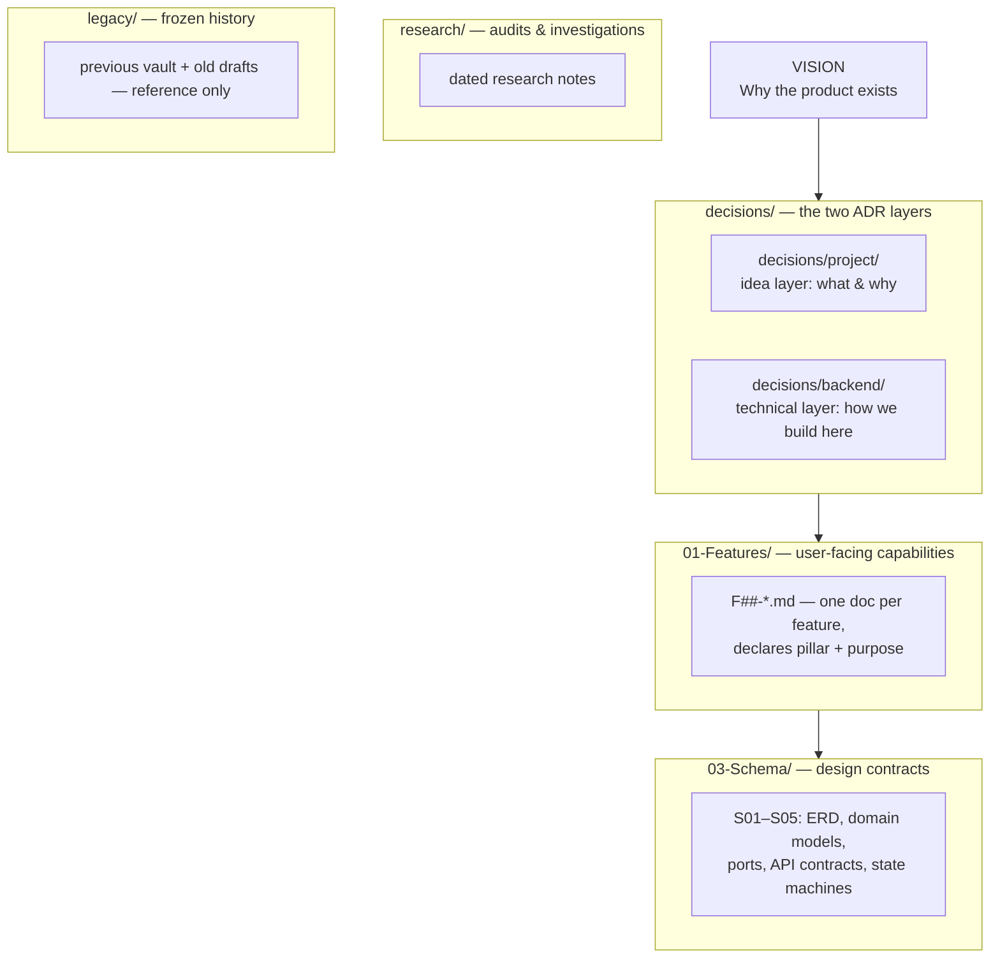

# 00-Index

---
tags: ["index", "hourglass"]
---

# Hourglass Documentation Hub

**Last restructured:** 2026-07-28
**Governing document:** [[VISION]]

> **2026-07-31 — v0.1 P0 gate closed.** All six P0 items from the pre-deployment
> audit are verified Fixed (see the audit §6 priority matrix). Phase 8
> (pre-deployment hardening) is complete; the deployment blocker list is empty.

Hourglass is a **work operations platform**: it removes the meta-work around work so people focus on real work. Everything in this vault traces back to the mission, three questions, and four pillars defined in [[VISION]].

---

## Read This First

1. [[VISION]] — mission, the three questions, the four pillars, the steering test, out-of-scope anchors. **Nothing enters the roadmap without passing through here.**
2. [[research/2026-07-28 — Pre-Deployment Audit — Hourglass v0.1]] — current state: bugs, ADR compliance, pre-deployment priorities.

---

## Vault Map

```mermaid
flowchart TD
    Vision["VISION<br/>Why the product exists"]

    subgraph Decisions["decisions/ — the two ADR layers"]
        DProj["decisions/project/<br/>idea layer: what & why"]
        DBack["decisions/backend/<br/>technical layer: how we build here"]
    end

    subgraph Features["01-Features/ — user-facing capabilities"]
        F["F##-*.md — one doc per feature,<br/>declares pillar + purpose"]
    end

    subgraph Schema["03-Schema/ — design contracts"]
        S["S01–S05: ERD, domain models,<br/>ports, API contracts, state machines"]
    end

    subgraph Research["research/ — audits & investigations"]
        R["dated research notes"]
    end

    subgraph Legacy["legacy/ — frozen history"]
        L["previous vault + old drafts — reference only"]
    end

    Vision --> Decisions --> Features --> Schema
```

| Folder | Layer | Contents |
|--------|-------|----------|
| [[VISION]] | Idea | Mission, three questions, four pillars, steering test |
| `decisions/project/` | Idea (ADRs) | What we build and **why** — pillars, purposes, sequencing, scope. Index: `decisions/project/_index.md` |
| `decisions/backend/` | Technical (ADRs) | **Project-specific** Go decisions — deltas from the global vault. Index: `decisions/backend/_index.md` |
| `01-Features/` | Product | One doc per feature: stories, workflows, acceptance criteria, **pillar + purpose** |
| `03-Schema/` | Technical | Design contracts: ERD, domain models, ports, API contracts, state machines |
| `research/` | Working | Audits and investigations (dated, append-only) |
| `legacy/` | Frozen | Previous vault + `legacy/old/` drafts. No longer maintained — reference only. |

---

## The ADR Model (two layers)

| Layer | Folder | Governs | Relationship to knowledge vault |
|-------|--------|---------|--------------------------------|
| **Project decisions** | `decisions/project/` | What & why — vision-level choices | None — product thinking, not tech |
| **Backend decisions** | `decisions/backend/` | How we build *in this repo* | **Deltas only** from the global vault |

**Rule:** The global knowledge vault (`knowledge/adr/…`) is the main source for technical decisions **globally**. A project ADR exists only where Hourglass **deviates, extends, or adds** what the global ADRs cover. If a topic is already decided globally, **link it — never duplicate it.** Backend ADRs marked `(promote)` are candidates for a future global Go set.

---

## Naming & Conventions

| Doc type | Format | Example |
|----------|--------|---------|
| Feature | `F##-Feature-Name.md` | `F07-Time-Entries.md` |
| Schema contract | `S##-Topic-Name.md` | `S01-Database-ERD.md` |
| Project decision | `decisions/project/ADR-P-NNN — Title.md` | `ADR-P-001 — Units vs Working Groups` |
| Backend decision | `decisions/backend/ADR-BE-NNN — Title.md` | `ADR-BE-001 — Error Handling` |

* Feature/schema numbering continues the existing sequence — do not restart.
* Every feature doc declares its **pillar** and **purpose** at the top (see `01-Features/_TEMPLATE.md`).
* ADRs are append-only; supersession via status + links, never silent rewrites.

---

## Current State

| Area | Status |
|------|--------|
| Vision | ✅ Drafted ([[VISION]]) |
| Idea-layer ADRs | ✅ 9 drafted (ADR-P-001…008, P-011; P-001/P-007 **Accepted**, rest **Proposed** — awaiting your review) |
| Backend ADRs | ✅ 14 drafted (ADR-BE-001…014, all **Accepted**) |
| Feature docs | ✅ F05–F13 exist; F07–F13 are vision-aligned skeletons (pillar + purpose + surface) with ACs to backfill from `legacy/` |
| Schema contracts | ✅ S01–S05 exist (auth-era — need review against current code) |
| v0.1 MVP | ✅ Feature-complete; ✅ **P0 gate closed** (all six P0 fixes verified — see [[research/2026-07-28 — Pre-Deployment Audit — Hourglass v0.1]] §6); Phase 8 (pre-deployment hardening) complete; IA restructure per [[ADR-P-011 — Information Architecture & Role-Scoped Surfaces]] queued pre-deploy |

### Open resolutions for you to confirm

1. **ADR-P-001** — units = accountability, working groups = execution. Flagged that current approval routing blurs this; a backend ADR on routing precedence will be needed.
2. **ADR-P-003/004 dependency** — Today view (V1) is blocked by tickets (V2); both are post-deployment (v0.2).
3. **Backend ADR home** — `decisions/backend/` is "project deltas only" until a global Go ADR set exists. Say the word if you'd rather have one canonical backend location from day one.
4. **ADR-P-011 (IA)** — **Resolved 2026-07-30:** scope absorbed pre-deploy. Today landing, Approvals queue, Working Groups surface, and the `/activities` rename all ship in v0.1.

### Missing at the idea layer (next, post-deployment)

* **ADR-P-009** — employee knowledge profile shape (needs ADR-P-001 + history)
* **ADR-P-010** — contract budget/target fields (V6 prerequisite, decided at V4 design time)
* **Customer-facing read surface** — stakeholder-map slot, unspecced
* Feature docs for the vision surfaces (Today, Tickets, Availability, Working Groups) when their phases start

## App Information Architecture (ADR-P-011)

The sidebar encodes the pillars in job-language; surfaces follow the stakeholder map and render role-scoped. Target structure:

| Group | Items | Pillar |
|-------|-------|--------|
| *(landing)* | **Today** `/` — ticketless composition pre-deploy (P-011 D-2) | Insight |
| **Track** | Time · Expenses · Tickets (v0.2) | Capture |
| **Work** | Activities (`/activities`, renamed) · Working Groups (new) | Structure |
| **People** | Org · Availability (P-008) | Structure |
| **Economics** | Contracts · Customers | Structure (commercial) |
| **Review** | Approvals — role-gated queues | Control |
| **Reports** | Exports · payroll view (P-008 D-1c) | Insight |
| **Admin** | Invitations · Activity kinds · Roles | Control |

Full visibility matrix per org role: [[ADR-P-011 — Information Architecture & Role-Scoped Surfaces]] D-5.

---

## Quick Navigation

| I need… | Go to… |
|---------|--------|
| The product's reason to exist | [[VISION]] |
| What we're building & why | `decisions/project/_index.md` |
| How the backend is built here | `decisions/backend/_index.md` |
| App navigation & role surfaces | [[ADR-P-011 — Information Architecture & Role-Scoped Surfaces]] |
| A feature's user workflow | `01-Features/` |
| API specification | [[S04-API-Contracts]] |
| Database structure | [[S01-Database-ERD]] |
| What blocks deployment | [[research/2026-07-28 — Pre-Deployment Audit — Hourglass v0.1]] |
| Historical mechanics (frozen) | `legacy/` |
