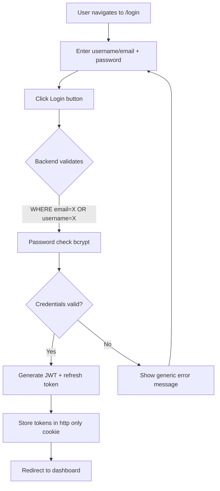
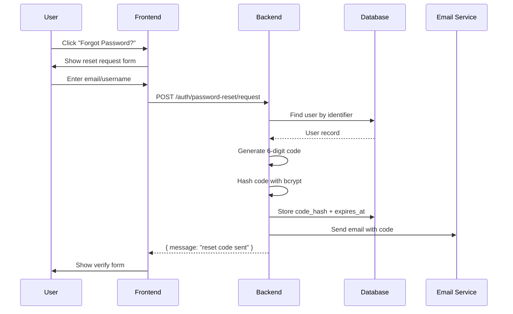
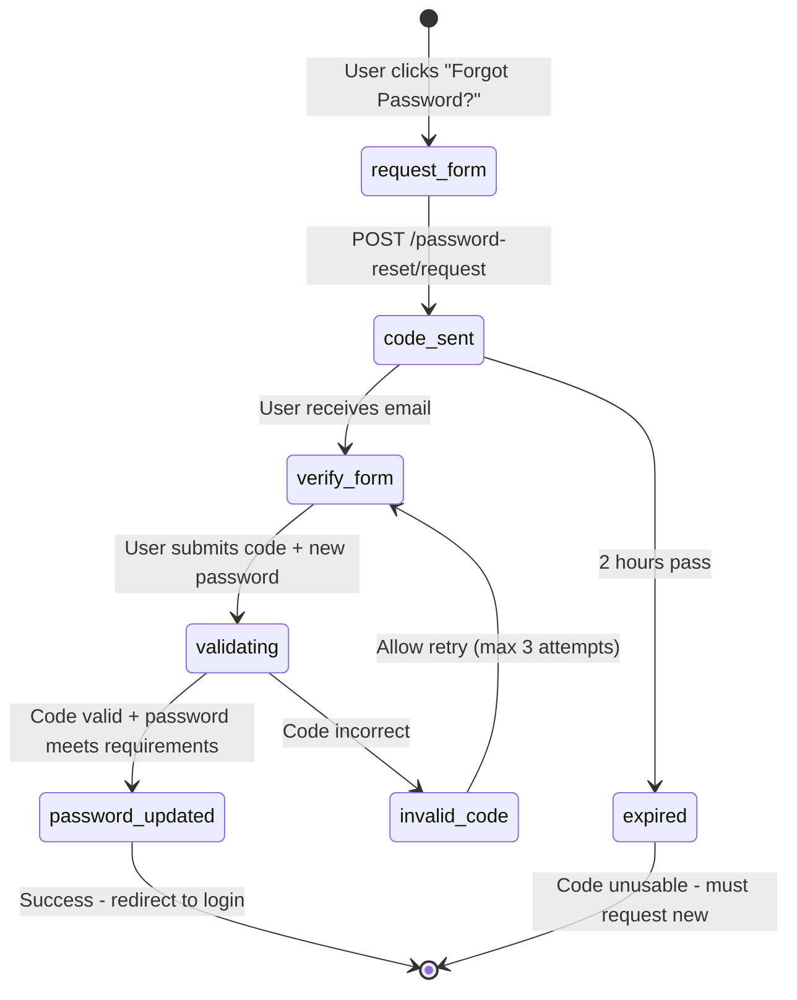

# Feature: User Authentication

## Overview
Unified authentication system allowing users to log in with either username or email, request password resets via 6-digit codes, and securely manage their sessions with JWT tokens. This replaces the previous email-only login and adds self-service password recovery.

## User Stories
| ID | Story | Status | PR |
|----|-------|--------|-----|
| US-001 | As a user, I can log in with my username OR email so that I have flexibility in how I access my account | ✅ Implemented | #4ab2fb9 |
| US-002 | As a user who forgot my password, I can request a reset code so that I can regain access to my account | ✅ Implemented | #41d8f09 |
| US-003 | As a security-conscious user, I want reset codes to expire after 2 hours so that old codes cannot be misused | ✅ Implemented | #41d8f09 |
| US-004 | As a user, I want clear error messages when login fails so that I know whether to retry or reset my password | ✅ Implemented | #4ab2fb9 |

## User Workflows

### Workflow 1: Unified Login (Username or Email)

**Steps:**
1. User navigates to `/login` route
2. User enters either username (e.g., `johndoe`) OR email (e.g., `john@example.com`) in the "Username or Email" field
3. User enters password and clicks "Login"
4. Frontend sends `POST /auth/login` with `{ identifier: "johndoe", password: "***" }`
5. Backend queries database: `WHERE email = $identifier OR username = $identifier`
6. Backend validates password using bcrypt comparison
7. On success: Backend generates JWT access token and refresh token
8. Frontend stores tokens and redirects to authenticated dashboard
9. On failure: Generic error message shown (doesn't reveal if username exists)

### Workflow 2: Password Reset Request

### Workflow 3: Password Reset Verification

## Acceptance Criteria
- [x] Login accepts username OR email in single `identifier` field
- [x] Existing users without usernames can still login with email
- [x] Password reset codes are 6 digits and expire after 2 hours
- [x] Rate limiting prevents more than 3 reset requests per hour
- [x] Generic error messages don't reveal whether username exists
- [x] Reset codes are bcrypt-hashed before storage
- [x] Used reset codes are marked as used and cannot be reused

## Related Features
- [[F05-Org-Bootstrap]] - Organization creation during registration
- [[F06-Invitation-System]] - Alternative registration via invitation
- [[T02-Auth-Implementation]] - Technical implementation details

## Last Updated
- **PR**: #4ab2fb9, #41d8f09
- **Merged**: 2026-04-19
- **Author**: @hourglass-team
