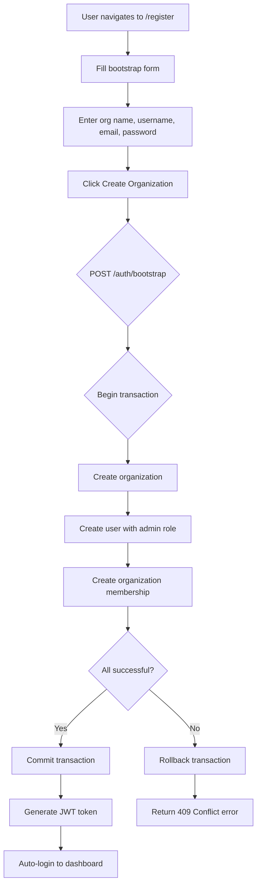
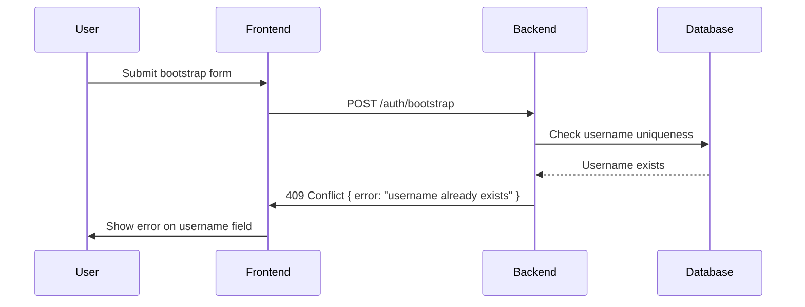

# Feature: Organization Bootstrap

## Overview
Streamlined organization creation flow that allows users to create both an organization and their admin account in a single atomic operation. This eliminates the multi-step process of first registering a user, then creating an organization, then assigning the user as admin.

## User Stories
| ID | Story | Status | PR |
|----|-------|--------|-----|
| US-001 | As a new user, I can create an organization and my admin account in one step so that I can start using the system immediately | ✅ Implemented | #d400192 |
| US-002 | As a new user, I want to be automatically logged in after creating my organization so that I can start configuring it right away | ✅ Implemented | #d400192 |
| US-003 | As a system, I need to ensure org + user creation is atomic so that we never have orphaned users or organizations | ✅ Implemented | #d400192 |

## User Workflows

### Workflow 1: Bootstrap Organization Creation

**Steps:**
1. User navigates to `/register` route (BootstrapOrgForm component)
2. User fills form with:
   - Organization name (e.g., "Acme Corp")
   - Username (e.g., "johndoe")
   - Email (e.g., "john@acme.com")
   - Password (min 8 characters)
   - First name and last name
3. User clicks "Create Organization"
4. Frontend sends `POST /auth/bootstrap` with all fields
5. Backend starts database transaction
6. Backend creates organization record, generates unique slug
7. Backend creates user record with bcrypt-hashed password
8. Backend creates organization_membership with role="admin"
9. If all successful: commit transaction, generate JWT
10. If any fails: rollback entire transaction, return error
11. Frontend receives JWT, stores in localStorage
12. User is automatically logged in and redirected to organization settings

### Workflow 2: Duplicate Prevention

## Acceptance Criteria
- [x] `POST /auth/bootstrap` creates org + user in atomic transaction
- [x] User is auto-logged in (JWT returned in response)
- [x] Username uniqueness enforced (409 Conflict if duplicate)
- [x] Email uniqueness enforced (409 Conflict if duplicate)
- [x] Password validation (min 8 chars)
- [x] Organization slug is auto-generated and unique
- [x] Transaction rollback on partial failure
- [x] User assigned admin role automatically

## Related Features
- [[F04-User-Authentication]] - Base authentication system
- [[F06-Invitation-System]] - Alternative way to join existing orgs
- [[T02-Auth-Implementation]] - Technical implementation details

## Last Updated
- **PR**: #d400192
- **Merged**: 2026-04-19
- **Author**: @hourglass-team
