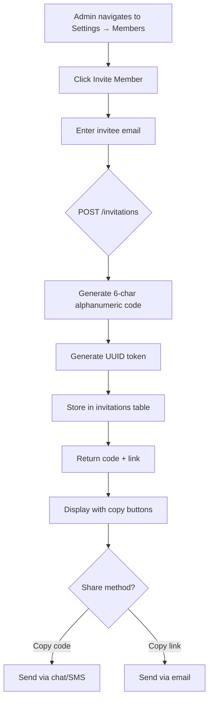
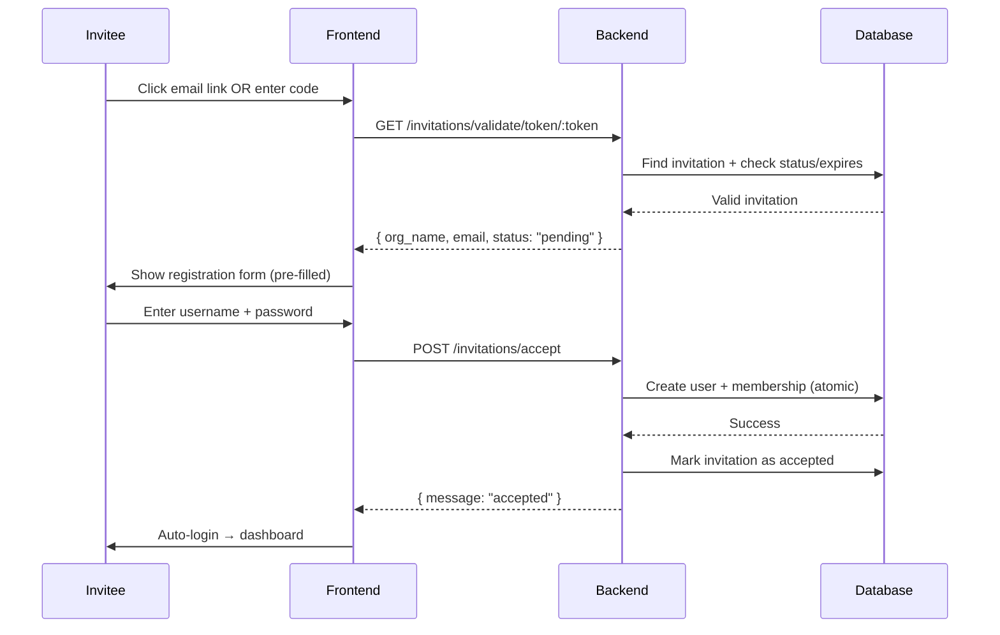

# Feature: Invitation System

## Overview
Invitation-based user registration system that allows organization admins to invite new members via shareable codes or email links. This enables controlled user onboarding where organizations can manage who joins their team.

## User Stories
| ID | Story | Status | PR |
|----|-------|--------|-----|
| US-001 | As an admin, I can generate invitation codes to share with team members so that only invited users can join | ✅ Implemented | #0ed701a |
| US-002 | As an invitee, I can receive an invitation link via email so that I can easily accept without typing a code | ✅ Implemented | #0ed701a |
| US-003 | As an invitee, I want invitations to expire after 7 days so that old invitations don't remain valid indefinitely | ✅ Implemented | #0ed701a |
| US-004 | As an admin, I want invitees to be assigned the employee role by default so that I maintain control over permissions | ✅ Implemented | #0ed701a |

## User Workflows

### Workflow 1: Create Invitation (Admin)


**Steps:**
1. Admin navigates to Organization Settings → Members tab
2. Admin clicks "Invite Member" button
3. Admin enters invitee's email address
4. Frontend sends `POST /invitations` with `{ email: "user@example.com", expires_in_days: 7 }`
5. Backend generates 6-character alphanumeric code (e.g., "ABC123")
6. Backend generates UUID token for email deep linking
7. Backend stores invitation with expires_at timestamp
8. Backend returns both code and full invitation link
9. Frontend displays code and link with copy buttons
10. Admin shares code/link with invitee

### Workflow 2: Accept Invitation (Invitee)


### Workflow 3: Invitation Validation
```mermaid
stateDiagram-v2
    [*] --> pending: Admin creates invitation
    pending --> valid_code: Invitee enters code
    pending --> valid_token: Invitee clicks email link
    valid_code --> verifying{Check validity}
    valid_token --> verifying
    verifying --> accepted: Valid + not expired
    verifying --> expired: Past expires_at
    verifying --> already_used: Status != pending
    expired --> [*]: Return 410 Gone
    already_used --> [*]: Return 409 Conflict
    accepted --> complete: User completes registration
    complete --> [*]: Invitation consumed
```

## Acceptance Criteria
- [x] `POST /invitations` generates unique 6-char code + UUID token
- [x] Admin-only authorization (403 for non-admins)
- [x] Response includes `code`, `link` (full URL with token)
- [x] Frontend displays code and link with copy buttons
- [x] `GET /invitations/validate/:code` returns invitation details or 404/410
- [x] `POST /invitations/accept` creates user + membership atomically
- [x] New users assigned `employee` role automatically
- [x] Invitation marked as `accepted` after use
- [x] Expired invitations return 410 Gone

## Related Features
- [[F04-User-Authentication]] - Alternative registration method
- [[F05-Org-Bootstrap]] - Creating new org vs joining existing
- [[T02-Auth-Implementation]] - Technical implementation details

## Last Updated
- **PR**: #0ed701a
- **Merged**: 2026-04-19
- **Author**: @hourglass-team
