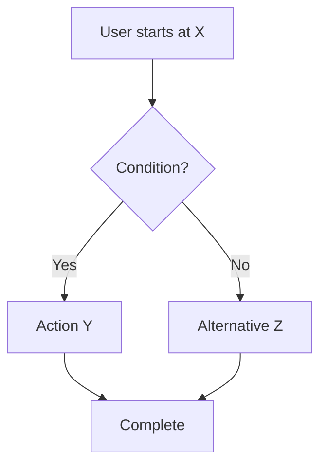
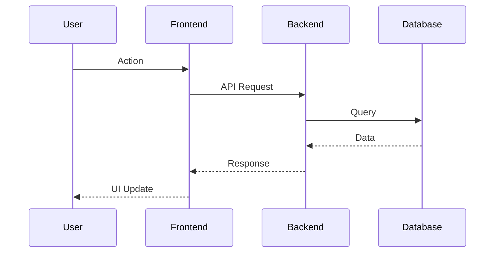

# Feature: [Feature Name]

## Overview
One-paragraph description from user perspective. What problem does this solve for users?

## User Stories
| ID | Story | Status | PR |
|----|-------|--------|-----|
| US-001 | As a [role], I can [action] so that [benefit] | ✅ Implemented | #000 |

## User Workflows

### Workflow 1: [Workflow Name]

**Steps:**
1. User navigates to...
2. User clicks...
3. System responds with...
4. User completes action

### Workflow 2: [Another Workflow]

## Acceptance Criteria
- [ ] Criterion 1 (testable)
- [ ] Criterion 2 (testable)
- [ ] Criterion 3 (testable)

## Related Features
- [[F02-Feature-Name]] - Related feature
- [[F03-Another-Feature]] - Another related feature

## Last Updated
- **PR**: #[number]
- **Merged**: YYYY-MM-DD
- **Author**: @username
