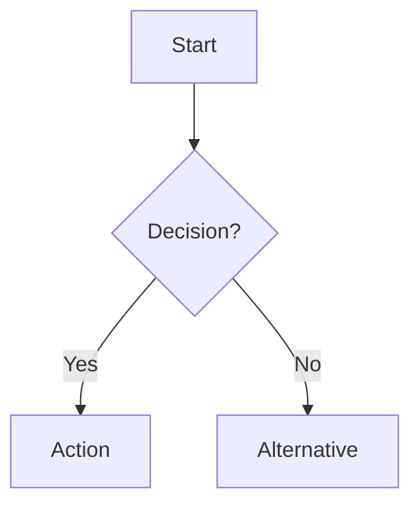

# _TEMPLATE — Feature Doc

---
tags: ["template", "feature"]
---

# F## — Feature Name

> Copy this file to `F##-Feature-Name.md` (next number in sequence) and fill it in. Every field exists to keep the feature tied to the vision — if a section feels unnecessary, that's a signal the feature may not belong.

## Pillar & Purpose

| Field | Value |
|-------|-------|
| **Pillar** | Capture / Structure / Control / Insight *(pick one, per [[VISION]] §4)* |
| **Purpose** | *One sentence: why this feature exists, stated as the question or pain it removes — not what it does.* |
| **Answers** | *Which of the three questions it serves: "What should I be working on?" / "Is the work on track?" / "What does the work cost and earn?"* |
| **Vision ref** | *[[VISION]] §x or V# it operationalizes* |
| **Decision ref** | *ADR-P-NNN that authorized it (must exist before a SPEC)* |
| **Surface** | *Where it lives in the app IA — nav group → item (route), per [[ADR-P-011 — Information Architecture & Role-Scoped Surfaces]]* |

## Overview

*Two–three sentences. What the user can now do, in their language.*

## User Stories

| ID | Story | Status | PR |
|----|-------|--------|-----|
| US-001 | As a …, I can … so that … | ⬜ | |

## User Workflows

```mermaid
flowchart TD
    A[Start] --> B{Decision?}
    B -->|Yes| C[Action]
    B -->|No| D[Alternative]
```

**Steps:**
1. …

## Acceptance Criteria

- [ ] …

## Boundaries

*What this feature deliberately does **not** do (prevents scope creep at the feature level). Cite [[VISION]] §8 where relevant.*

- Does not: …

## Related

- [[VISION]]
- [[ADR-P-…]] (authorizing decision)
- Feature docs: [[F##-…]]
- Technical: [[T##-…]] · Schema: [[S##-…]]

## Status

- **Status:** Draft / In progress / Implemented
- **Last updated:** YYYY-MM-DD
