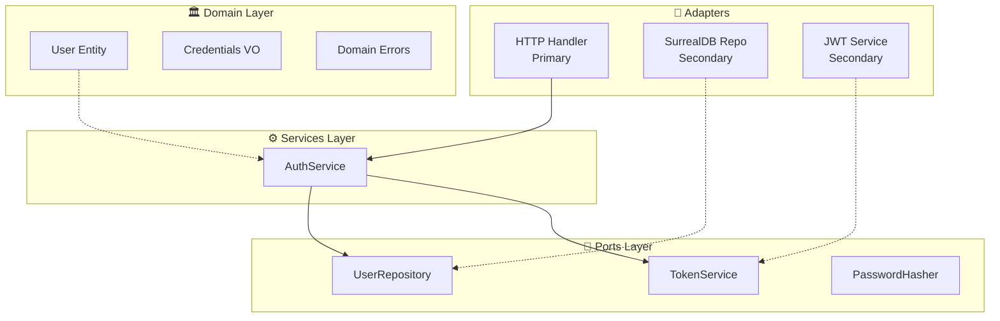

# Technical: Hexagonal Architecture

## Overview
Hourglass is migrating from a handler-based architecture to hexagonal (ports & adapters) architecture. This guide documents the pattern, migration approach, and benefits.

## Architecture Decisions
### Decision 1: Hexagonal Over Clean Architecture
**Context:** Need better separation of concerns and testability.  
**Decision:** Adopt hexagonal architecture with domain → ports → services → adapters flow.  
**Consequences:**
- ✅ Business logic isolated from frameworks
- ✅ Easy to swap databases (SurrealDB → PostgreSQL → etc.)
- ✅ Services are testable without HTTP or DB
- ⚠️ More files and interfaces to maintain
- ⚠️ Initial migration effort required



## Target Directory Structure

```
internal/
├── core/
│   ├── domain/
│   │   └── auth/
│   │       ├── user.go           # User entity
│   │       ├── credentials.go    # Email, password value objects
│   │       └── errors.go         # Domain errors
│   ├── services/
│   │   └── auth/
│   │       ├── auth.go           # AuthService struct + interface
│   │       ├── register.go       # Register use case
│   │       └── login.go          # Login use case
│   └── ports/
│       ├── user_repository.go    # UserRepository port interface
│       ├── token_service.go      # Token generation/validation port
│       └── password_hasher.go    # Password hashing port
├── adapters/
│   ├── primary/
│   │   └── http/
│   │       └── auth.go           # HTTP handlers (thin, delegates to service)
│   └── secondary/
│       └── surrealdb/
│           ├── user_repository.go # Implements UserRepository
│           └── token_service.go   # Implements TokenService
└── ports/                         # Re-export for clarity
```

## Migration Pattern

### Step 1: Extract Domain Entities
```go
// internal/core/domain/auth/user.go
package auth

import "github.com/google/uuid"

type User struct {
    ID        uuid.UUID
    Email     string
    Username  string
    Password  Password  // Value object
}

// Value Object: Password
type Password struct {
    hash string
}

func NewPassword(plain string) (Password, error) {
    if len(plain) < 8 {
        return Password{}, ErrPasswordTooShort
    }
    return Password{hash: bcryptHash(plain)}, nil
}
```

### Step 2: Define Ports (Interfaces)
```go
// internal/core/ports/user_repository.go
package ports

import (
    "context"
    "github.com/google/uuid"
    "hourglass/internal/core/domain/auth"
)

type UserRepository interface {
    FindByID(ctx context.Context, id uuid.UUID) (*auth.User, error)
    FindByIdentifier(ctx context.Context, identifier string) (*auth.User, error)
    Create(ctx context.Context, user *auth.User) error
    Update(ctx context.Context, user *auth.User) error
}
```

### Step 3: Create Service Layer
```go
// internal/core/services/auth/auth.go
package auth

import (
    "context"
    "hourglass/internal/core/domain/auth"
    "hourglass/internal/core/ports"
)

type AuthService struct {
    userRepo    ports.UserRepository
    tokenService ports.TokenService
    hasher      ports.PasswordHasher
}

func NewAuthService(userRepo ports.UserRepository, tokenService ports.TokenService, hasher ports.PasswordHasher) *AuthService {
    return &AuthService{
        userRepo:    userRepo,
        tokenService: tokenService,
        hasher:      hasher,
    }
}

func (s *AuthService) Login(ctx context.Context, identifier, password string) (*auth.User, *Token, error) {
    user, err := s.userRepo.FindByIdentifier(ctx, identifier)
    if err != nil {
        return nil, nil, ErrUserNotFound
    }
    
    if !s.hasher.Compare(user.Password, password) {
        return nil, nil, ErrInvalidCredentials
    }
    
    token, err := s.tokenService.Generate(user.ID, user.Email)
    return user, token, nil
}
```

### Step 4: Implement Secondary Adapters
```go
// internal/adapters/secondary/surrealdb/user_repository.go
package surrealdb

import (
    "context"
    "hourglass/internal/core/domain/auth"
    "hourglass/internal/core/ports"
)

type SurrealUserRepository struct {
    db *surrealdb.DB
}

func NewSurrealUserRepository(db *surrealdb.DB) ports.UserRepository {
    return &SurrealUserRepository{db: db}
}

func (r *SurrealUserRepository) FindByIdentifier(ctx context.Context, identifier string) (*auth.User, error) {
    // Query: WHERE email = $1 OR username = $1
    result, err := r.db.Query("SELECT * FROM users WHERE email = $1 OR username = $1", identifier)
    // ... convert to domain User entity
    return user, nil
}
```

### Step 5: Create Thin Primary Adapter (HTTP Handler)
```go
// internal/adapters/primary/http/auth.go
package http

import (
    "encoding/json"
    "net/http"
    "hourglass/internal/core/services/auth"
)

type AuthHandler struct {
    service *auth.AuthService
}

func NewAuthHandler(service *auth.AuthService) *AuthHandler {
    return &AuthHandler{service: service}
}

func (h *AuthHandler) Login(w http.ResponseWriter, r *http.Request) {
    var req LoginRequest
    if err := json.NewDecoder(r.Body).Decode(&req); err != nil {
        http.Error(w, err.Error(), http.StatusBadRequest)
        return
    }
    
    user, token, err := h.service.Login(r.Context(), req.Identifier, req.Password)
    if err != nil {
        writeError(w, err)
        return
    }
    
    writeJSON(w, http.StatusOK, Response{
        Data: LoginResponse{
            Token: token.AccessToken,
            User:  toUserDTO(user),
        },
    })
}
```

### Step 6: Wire in main.go
```go
// cmd/server/main.go
func main() {
    // Database
    db := surrealdb.New(config.SurrealDBURL)
    
    // Secondary adapters
    userRepo := surrealdb.NewUserRepository(db)
    tokenService := surrealdb.NewTokenService(config.JWTSecret)
    hasher := surrealdb.NewPasswordHasher()
    
    // Service layer
    authService := auth.NewAuthService(userRepo, tokenService, hasher)
    
    // Primary adapter
    authHandler := http.NewAuthHandler(authService)
    
    // Route registration
    mux.HandleFunc("POST /auth/login", authHandler.Login)
    mux.HandleFunc("POST /auth/register", authHandler.Register)
    
    // Start server
    http.ListenAndServe(":8080", mux)
}
```

## Benefits of Hexagonal Architecture

### 1. Testability
```go
// Mock repository for testing
type MockUserRepository struct {
    users map[uuid.UUID]*auth.User
}

func (m *MockUserRepository) FindByIdentifier(ctx context.Context, identifier string) (*auth.User, error) {
    // In-memory lookup - no database needed
    for _, user := range m.users {
        if user.Email == identifier || user.Username == identifier {
            return user, nil
        }
    }
    return nil, auth.ErrUserNotFound
}

// Test without database
func TestAuthService_Login_Success(t *testing.T) {
    mockRepo := &MockUserRepository{users: testUsers}
    mockToken := &MockTokenService{}
    mockHasher := &MockPasswordHasher{}
    
    service := auth.NewAuthService(mockRepo, mockToken, mockHasher)
    
    user, token, err := service.Login(context.Background(), "johndoe", "password123")
    
    assert.NoError(t, err)
    assert.NotNil(t, user)
    assert.NotNil(t, token)
}
```

### 2. Swappable Implementations
```go
// Want to switch from SurrealDB to PostgreSQL?
// Just implement the same port interface:

type PostgreSQLUserRepository struct {
    db *sql.DB
}

func (r *PostgreSQLUserRepository) FindByIdentifier(ctx context.Context, identifier string) (*auth.User, error) {
    // PostgreSQL implementation
}

// Wire in main.go instead:
userRepo := postgres.NewUserRepository(sqlDB)  // Instead of surrealdb.NewUserRepository
authService := auth.NewAuthService(userRepo, tokenService, hasher)
```

## Migration Checklist

### Completed Migrations
- [x] Auth service (domain → ports → service → adapters)
- [x] Organization management
- [x] Contract management
- [x] Project management
- [x] Customer management
- [x] Export service
- [x] Approval workflows
- [x] Working groups
- [x] Units

### Remaining
- [ ] Time entries (in progress)
- [ ] Expenses (in progress)
- [ ] Tests for all migrated services
- [ ] Bootstrap endpoint

## Related Technical Docs
- [[T02-Auth-Implementation]] - Example of hexagonal auth service
- [[S03-Ports-Interfaces]] - All port definitions
- [[S02-Domain-Models]] - Domain entities

## Last Updated
- **PR**: #b9a1f8d, #68df29f, #e0c7376, #2989a64, #fd567fd
- **Merged**: 2026-04-19
- **Author**: @hourglass-team
