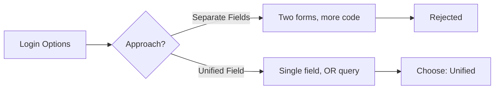

# Technical: Authentication Implementation

## Architecture Decisions
### Decision 1: Unified Login Identifier
**Context:** Users wanted flexibility to login with either username or email, but maintaining two separate login flows was complex.  
**Decision:** Single `identifier` field that accepts both username and email.  
**Consequences:** 
- ✅ Simpler UX (one field instead of two)
- ✅ Backward compatible (existing email-only users unaffected)
- ⚠️ Database query slightly more complex (OR condition)
- ⚠️ Must ensure username uniqueness to avoid ambiguity



### Decision 2: Password Reset Code Storage
**Context:** Password reset codes need to be secure but also user-friendly (6 digits).  
**Decision:** Store bcrypt-hashed codes, similar to password storage.  
**Consequences:**
- ✅ Secure against code leakage
- ✅ Same hashing infrastructure as passwords
- ⚠️ Cannot show user their code (must send new one each time)
- ✅ Codes are single-use (marked as used after verification)

## Implementation Details

### Backend
#### New Endpoints
| Method | Path | Handler | Description |
|--------|------|---------|-------------|
| POST | `/auth/login` | `AuthHandler.Login()` | Unified login with identifier |
| POST | `/auth/bootstrap` | `AuthHandler.Bootstrap()` | Create org + admin atomically |
| POST | `/auth/password-reset/request` | `AuthHandler.PasswordResetRequest()` | Generate reset code |
| POST | `/auth/password-reset/verify` | `AuthHandler.PasswordResetVerify()` | Verify code + update password |
| POST | `/invitations` | `InvitationHandler.Create()` | Create invitation (admin only) |
| GET | `/invitations/validate/code/:code` | `InvitationHandler.ValidateCode()` | Validate by code |
| GET | `/invitations/validate/token/:token` | `InvitationHandler.ValidateToken()` | Validate by token |
| POST | `/invitations/accept` | `InvitationHandler.Accept()` | Accept invitation |

#### Service Layer
```go
type AuthService struct {
    userRepo    UserRepository
    tokenService TokenService
    hasher      PasswordHasher
}

func (s *AuthService) Login(ctx context.Context, identifier, password string) (*User, *Token, error) {
    // Find user by email OR username
    user, err := s.userRepo.FindByIdentifier(ctx, identifier)
    if err != nil {
        return nil, nil, ErrInvalidCredentials
    }
    
    // Validate password
    if !s.hasher.Compare(user.PasswordHash, password) {
        return nil, nil, ErrInvalidCredentials
    }
    
    // Generate tokens
    token, err := s.tokenService.Generate(user.ID, user.Email)
    return user, token, nil
}

func (s *AuthService) Bootstrap(ctx context.Context, req BootstrapRequest) (*BootstrapResponse, error) {
    return s.db.WithTx(func(tx *sql.Tx) (*BootstrapResponse, error) {
        // 1. Create organization
        org, err := s.orgRepo.Create(ctx, tx, req.OrgName)
        
        // 2. Create user
        user, err := s.userRepo.Create(ctx, tx, CreateUserRequest{
            Email: req.Email,
            Username: req.Username,
            PasswordHash: s.hasher.Hash(req.Password),
        })
        
        // 3. Create membership with admin role
        _, err = s.membershipRepo.Create(ctx, tx, user.ID, org.ID, RoleAdmin)
        
        // 4. Generate token
        token, _ := s.tokenService.Generate(user.ID, user.Email)
        
        return &BootstrapResponse{
            Token: token,
            User: user,
            Organization: org,
        }, nil
    })
}
```

#### Repository Changes
```go
type UserRepository interface {
    // NEW: Find by email OR username
    FindByIdentifier(ctx context.Context, identifier string) (*User, error)
    
    // NEW: Create with transaction support
    Create(ctx context.Context, tx *sql.Tx, req CreateUserRequest) (*User, error)
}

type InvitationRepository interface {
    Create(ctx context.Context, req CreateInvitationRequest) (*Invitation, error)
    FindByCode(ctx context.Context, code string) (*Invitation, error)
    FindByToken(ctx context.Context, token string) (*Invitation, error)
    Accept(ctx context.Context, id uuid.UUID) error
}
```

### Frontend
#### New Routes
| Path | Component | Protected |
|------|-----------|-----------|
| `/login` | `LoginForm` | No |
| `/register` | `BootstrapOrgForm` | No |
| `/password-reset` | `PasswordResetRequestForm` | No |
| `/password-reset/verify` | `PasswordResetVerifyForm` | No |
| `/invite` | `InvitationAcceptForm` | No |

#### React Query Hooks
```typescript
// Authentication hooks
function useLogin() {
  return useMutation({
    mutationFn: (credentials: { identifier: string; password: string }) =>
      api.post('/auth/login', credentials),
    onSuccess: (data) => {
      localStorage.setItem('token', data.token)
      localStorage.setItem('refreshToken', data.refresh_token)
    },
  })
}

function usePasswordReset() {
  return useMutation({
    mutationFn: (identifier: string) =>
      api.post('/auth/password-reset/request', { identifier }),
  })
}

function usePasswordResetVerify() {
  return useMutation({
    mutationFn: (data: { identifier: string; code: string; password: string }) =>
      api.post('/auth/password-reset/verify', data),
  })
}

// Invitation hooks
function useCreateInvitation() {
  return useMutation({
    mutationFn: (email: string) =>
      api.post('/invitations', { email, expires_in_days: 7 }),
  })
}

function useValidateInvitation() {
  return useQuery({
    queryKey: ['invitation', code],
    queryFn: () => api.get(`/invitations/validate/code/${code}`),
  })
}
```

#### Components
- `LoginForm.tsx` - Unified login with identifier field
- `BootstrapOrgForm.tsx` - Organization + admin creation
- `PasswordResetRequestForm.tsx` - Request reset code
- `PasswordResetVerifyForm.tsx` - Enter code + new password
- `InvitationAcceptForm.tsx` - Accept invitation + register
- `InvitationCodeInput.tsx` - 6-character code input with auto-advance

## Code Patterns
### Pattern 1: Atomic Transaction with Rollback
```go
func (s *Service) Bootstrap(ctx context.Context, req Request) (*Response, error) {
    return s.db.WithTx(func(tx *sql.Tx) (*Response, error) {
        // All operations in this block are atomic
        // If any fails, entire transaction rolls back
        
        org := createOrg(ctx, tx, req.OrgName)
        user := createUser(ctx, tx, req.UserData)
        membership := createMembership(ctx, tx, user.ID, org.ID, RoleAdmin)
        
        return &Response{org, user, membership}, nil
    })
}
```

### Pattern 2: Rate Limiting
```go
type RateLimiter struct {
    attempts map[string][]time.Time
    mu       sync.Mutex
}

func (rl *RateLimiter) Allow(identifier string, limit int, window time.Duration) bool {
    rl.mu.Lock()
    defer rl.mu.Unlock()
    
    now := time.Now()
    cutoff := now.Add(-window)
    
    // Filter old attempts
    attempts := rl.attempts[identifier]
    valid := []time.Time{}
    for _, t := range attempts {
        if t.After(cutoff) {
            valid = append(valid, t)
        }
    }
    
    if len(valid) >= limit {
        return false
    }
    
    rl.attempts[identifier] = append(valid, now)
    return true
}
```

## Testing Strategy
### Unit Tests
- `TestAuthService_Login_WithIdentifier_Success`
- `TestAuthService_Login_WithIdentifier_NotFound`
- `TestAuthService_Bootstrap_TransactionRollback`
- `TestAuthService_PasswordResetRequest_GeneratesCode`
- `TestAuthService_PasswordResetVerify_UpdatesPassword`
- `TestInvitationService_Create_GeneratesCodeAndToken`
- `TestInvitationService_Accept_CreatesUserAndMembership`

### Integration Tests
- `TestAuthHandler_Login_UsernameOrEmail`
- `TestAuthHandler_Bootstrap_EndToEnd`
- `TestAuthHandler_PasswordReset_Flow`
- `TestInvitationHandler_FullAcceptanceFlow`

### Test Commands
```bash
# Run all auth tests
go test ./internal/services/auth/... -v

# Run invitation tests
go test ./internal/services/invitation/... -v

# Run handler integration tests
go test ./internal/adapters/primary/http/... -v -run "TestAuth"
```

## Migration Notes
- **Schema changes required:** Yes
  - `users` table: Add `username`, `firstname`, `lastname` columns
  - `invitations` table: New table
  - `password_resets` table: New table
- **Backward compatibility:** Non-breaking (existing email-only users unaffected)
- **Rollback plan:** 
  1. Remove new columns from users table
  2. Drop invitations and password_resets tables
  3. Revert frontend to email-only login

## Related Technical Docs
- [[T01-Hexagonal-Architecture]] - Service layer pattern
- [[S04-API-Contracts]] - API specification
- [[S01-Database-ERD]] - Database schema

## Last Updated
- **PR**: #4ab2fb9, #d400192, #0ed701a, #41d8f09
- **Merged**: 2026-04-19
- **Author**: @hourglass-team
