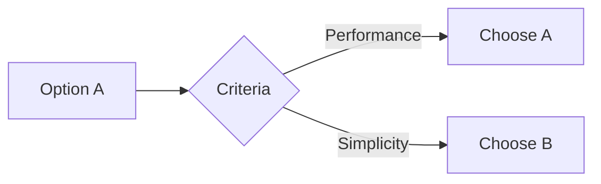

# Technical: [Feature Name]

## Architecture Decisions
### Decision 1: [Title]
**Context:** Why this decision was needed  
**Decision:** What we chose  
**Consequences:** Trade-offs, pros/cons



## Implementation Details

### Backend
#### New Endpoints
| Method | Path | Handler | Description |
|--------|------|---------|-------------|
| POST | `/api/endpoint` | `Handler.Method()` | What it does |

#### Service Layer
```go
type Service struct {
    repo Repository
}

func (s *Service) BusinessLogic() error {
    // Implementation
}
```

#### Repository Changes
```go
type Repository interface {
    NewMethod(ctx context.Context, param string) (*Entity, error)
}
```

### Frontend
#### New Routes
| Path | Component | Protected |
|------|-----------|-----------|
| `/route` | `ComponentName` | Yes |

#### React Query Hooks
```typescript
function useFeature() {
  return useQuery({
    queryKey: ['feature-key'],
    queryFn: api.getFeature,
  })
}
```

#### Components
- `ComponentName.tsx` - Description

## Code Patterns
### Pattern 1: [Name]
```go
// Example code showing pattern
```

## Testing Strategy
### Unit Tests
- `TestService_Method_Success`
- `TestService_Method_Error`

### Integration Tests
- `TestEndpoint_Authenticated`
- `TestEndpoint_Unauthorized`

### Test Commands
```bash
go test ./internal/services/... -v -run TestName
```

## Migration Notes
- Schema changes required: Yes/No
- Backward compatibility: Breaking/Non-breaking
- Rollback plan: [description]

## Related Technical Docs
- [[T02-Related-Topic]] - Related implementation

## Last Updated
- **PR**: #[number]
- **Merged**: YYYY-MM-DD
- **Author**: @username
