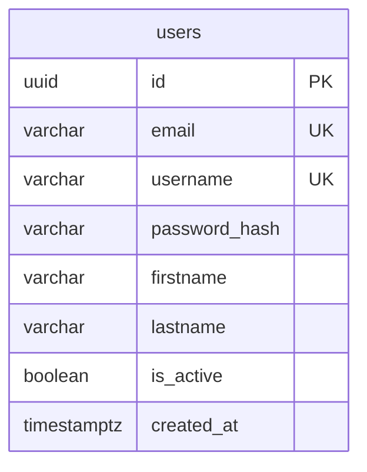
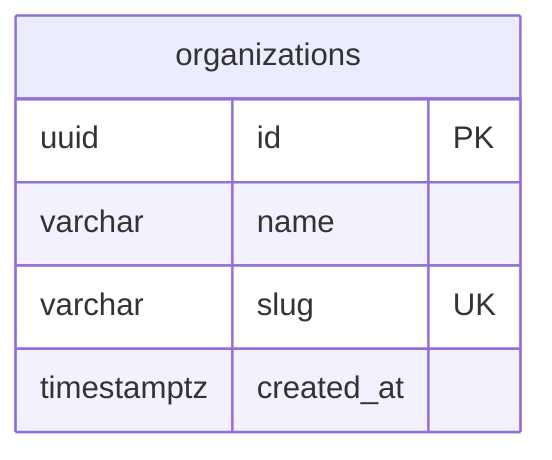
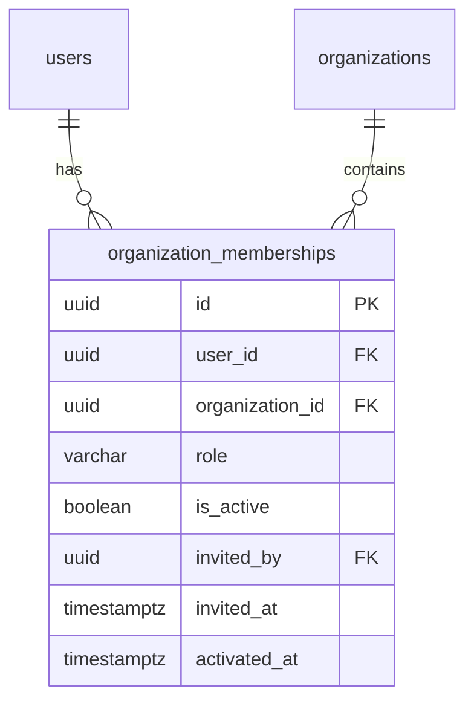
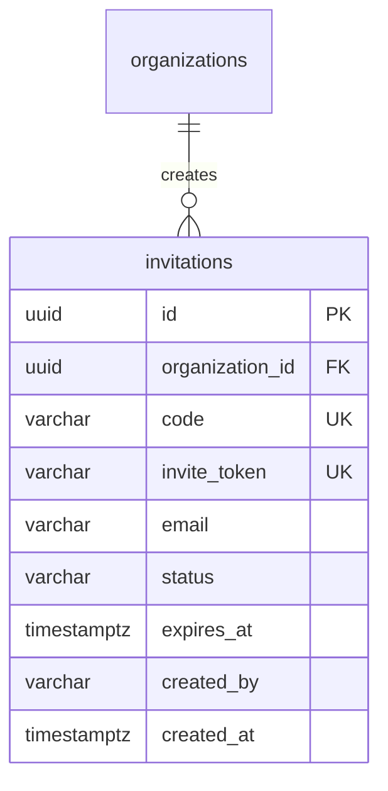
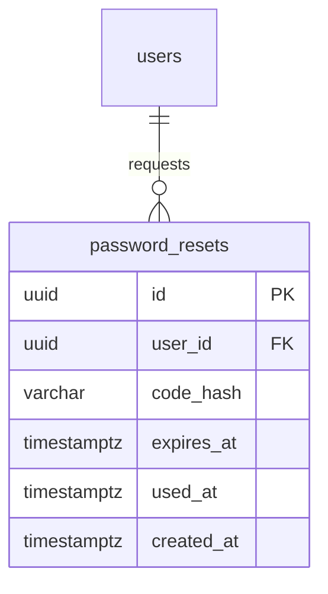

# Schema: Database ERD

## Overview
Complete entity-relationship diagram for Hourglass database, including new tables for authentication and invitation system.

## Core Entities

### Users Table


| Column | Type | Constraints | Description |
|--------|------|-------------|-------------|
| id | UUID | PRIMARY KEY | Unique user identifier |
| email | VARCHAR | UNIQUE, NOT NULL | Login identifier (legacy) |
| username | VARCHAR | UNIQUE, NULLABLE | Login identifier (new) |
| password_hash | VARCHAR | NOT NULL | bcrypt hashed password |
| firstname | VARCHAR | NULLABLE | User's first name |
| lastname | VARCHAR | NULLABLE | User's last name |
| is_active | BOOLEAN | DEFAULT true | Soft delete flag |
| created_at | TIMESTAMPTZ | DEFAULT now() | Account creation timestamp |

**Indexes:**
- `idx_users_email` - Email lookups
- `idx_users_username` - Username lookups
- `user_username` - Unique constraint on username

---

### Organizations Table


| Column | Type | Constraints | Description |
|--------|------|-------------|-------------|
| id | UUID | PRIMARY KEY | Unique organization identifier |
| name | VARCHAR | NOT NULL | Company/organization name |
| slug | VARCHAR | UNIQUE, NOT NULL | URL-friendly identifier |
| created_at | TIMESTAMPTZ | DEFAULT now() | Creation timestamp |

**Indexes:**
- `idx_organizations_slug` - Slug lookups

---

### Organization Memberships Table


| Column | Type | Constraints | Description |
|--------|------|-------------|-------------|
| id | UUID | PRIMARY KEY | Unique membership identifier |
| user_id | UUID | FK → users(id) | Reference to user |
| organization_id | UUID | FK → organizations(id) | Reference to organization |
| role | VARCHAR | CHECK (employee/manager/finance/customer) | User's role in org |
| is_active | BOOLEAN | DEFAULT true | Active membership flag |
| invited_by | UUID | FK → users(id), NULLABLE | Who sent the invitation |
| invited_at | TIMESTAMPTZ | NULLABLE | When invitation was sent |
| activated_at | TIMESTAMPTZ | NULLABLE | When user accepted invitation |

**Indexes:**
- `idx_organization_memberships_user_id` - Find user's memberships
- `idx_organization_memberships_org_id` - Find org members
- `UNIQUE (user_id, organization_id)` - One role per user per org

---

## Authentication Tables

### Invitations Table (NEW)


| Column | Type | Constraints | Description |
|--------|------|-------------|-------------|
| id | UUID | PRIMARY KEY | Unique invitation identifier |
| organization_id | UUID | FK → organizations(id) | Target organization |
| code | VARCHAR(6) | UNIQUE, NOT NULL | 6-char alphanumeric code |
| invite_token | UUID | UNIQUE, NOT NULL | UUID token for email links |
| email | VARCHAR | NULLABLE | Invitee's email address |
| status | VARCHAR | DEFAULT 'pending' | pending/accepted/expired |
| expires_at | TIMESTAMPTZ | NOT NULL | Code expiration timestamp |
| created_by | VARCHAR | NOT NULL | Creator's user ID |
| created_at | TIMESTAMPTZ | DEFAULT now() | Creation timestamp |

**Indexes:**
- `invite_code` - Unique constraint on code
- `invite_token` - Unique constraint on token

**Business Rules:**
- Codes are 6 characters, alphanumeric, case-insensitive
- Tokens are UUIDs used in email deep links
- Default expiry: 7 days from creation
- Status transitions: `pending` → `accepted` or `expired`

---

### Password Resets Table (NEW)


| Column | Type | Constraints | Description |
|--------|------|-------------|-------------|
| id | UUID | PRIMARY KEY | Unique reset request identifier |
| user_id | UUID | FK → users(id) | Reference to requesting user |
| code_hash | VARCHAR | NOT NULL | bcrypt-hashed 6-digit code |
| expires_at | TIMESTAMPTZ | NOT NULL | Code expiration (2 hours) |
| used_at | TIMESTAMPTZ | NULLABLE | When code was used (if any) |
| created_at | TIMESTAMPTZ | DEFAULT now() | Request creation timestamp |

**Indexes:**
- `pr_user` - Lookup by user_id

**Business Rules:**
- Codes are 6 digits (e.g., "123456")
- Codes expire after 2 hours
- Codes are single-use (marked as used after verification)
- Rate limit: max 3 requests per hour per user

---

## Domain Models

### User Entity
```go
type User struct {
    ID        uuid.UUID
    Email     string
    Username  string  // NEW: nullable, unique
    Password  Password // Value object
    FirstName string  // NEW
    LastName  string  // NEW
    IsActive  bool
    CreatedAt time.Time
}
```

**Value Object: Password**
```go
type Password struct {
    hash string  // bcrypt hashed
}

func NewPassword(plain string) (Password, error) {
    if len(plain) < 8 {
        return Password{}, ErrPasswordTooShort
    }
    hash, err := bcrypt.GenerateFromPassword([]byte(plain), 12)
    return Password{hash: string(hash)}, err
}

func (p Password) Compare(plain string) bool {
    err := bcrypt.CompareHashAndPassword([]byte(p.hash), []byte(plain))
    return err == nil
}
```

### Invitation Entity
```go
type Invitation struct {
    ID             uuid.UUID
    OrganizationID uuid.UUID
    Code           string      // 6-char code
    Token          uuid.UUID   // UUID for email links
    Email          string
    Status         InvitationStatus
    ExpiresAt      time.Time
    CreatedBy      uuid.UUID
    CreatedAt      time.Time
}

type InvitationStatus string

const (
    StatusPending   InvitationStatus = "pending"
    StatusAccepted  InvitationStatus = "accepted"
    StatusExpired   InvitationStatus = "expired"
)
```

### PasswordReset Entity
```go
type PasswordReset struct {
    ID        uuid.UUID
    UserID    uuid.UUID
    CodeHash  string
    ExpiresAt time.Time
    UsedAt    *time.Time
    CreatedAt time.Time
}
```

## Migrations

### 006_user_fields.surql
```sql
-- Add username, firstname, lastname to users
DEFINE FIELD username ON TABLE users TYPE option<string>;
DEFINE FIELD firstname ON TABLE users TYPE option<string>;
DEFINE FIELD lastname ON TABLE users TYPE option<string>;

-- Add unique index on username
DEFINE INDEX user_username ON TABLE users COLUMNS username UNIQUE;
```

### 007_invitations.surql
```sql
DEFINE TABLE invitations SCHEMAFULL;

DEFINE FIELD id ON TABLE invitations TYPE string DEFAULT record::id();
DEFINE FIELD organization_id ON TABLE invitations TYPE string;
DEFINE FIELD code ON TABLE invitations TYPE string;
DEFINE FIELD invite_token ON TABLE invitations TYPE string;
DEFINE FIELD email ON TABLE invitations TYPE option<string>;
DEFINE FIELD status ON TABLE invitations TYPE string DEFAULT 'pending';
DEFINE FIELD expires_at ON TABLE invitations TYPE datetime;
DEFINE FIELD created_by ON TABLE invitations TYPE string;
DEFINE FIELD created_at ON TABLE invitations TYPE datetime DEFAULT time::now();

DEFINE INDEX invite_code ON TABLE invitations COLUMNS code UNIQUE;
DEFINE INDEX invite_token ON TABLE invitations COLUMNS invite_token UNIQUE;
```

### 008_password_resets.surql
```sql
DEFINE TABLE password_resets SCHEMAFULL;

DEFINE FIELD id ON TABLE password_resets TYPE string DEFAULT record::id();
DEFINE FIELD user_id ON TABLE password_resets TYPE record<users>;
DEFINE FIELD code_hash ON TABLE password_resets TYPE string;
DEFINE FIELD expires_at ON TABLE password_resets TYPE datetime;
DEFINE FIELD used_at ON TABLE password_resets TYPE option<datetime>;
DEFINE FIELD created_at ON TABLE password_resets TYPE datetime DEFAULT time::now();

DEFINE INDEX pr_user ON TABLE password_resets COLUMNS user_id;
```

## Related Schema Docs
- [[S02-Domain-Models]] - Domain entities and value objects
- [[S03-Ports-Interfaces]] - Repository interfaces
- [[S05-State-Machines]] - Invitation and password reset state machines

## Last Updated
- **PR**: #d400192, #0ed701a, #41d8f09
- **Merged**: 2026-04-19
- **Author**: @hourglass-team
