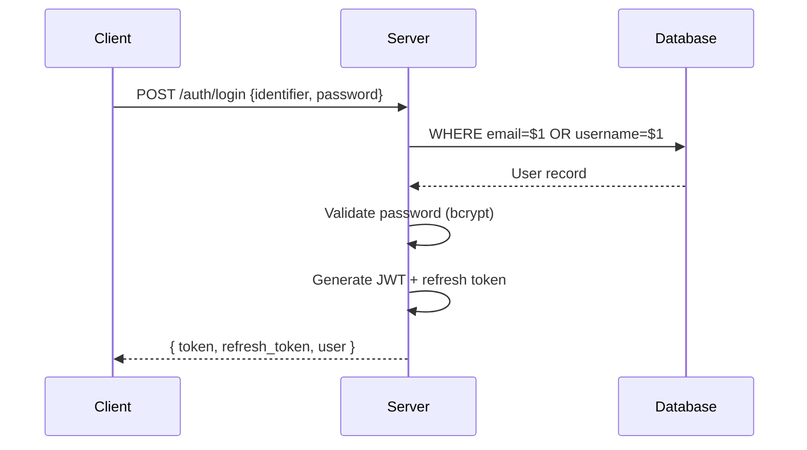
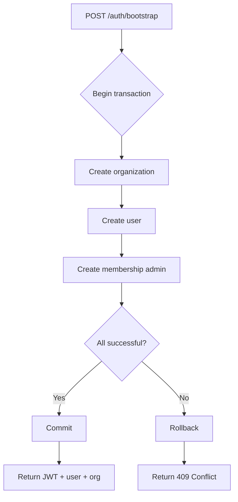
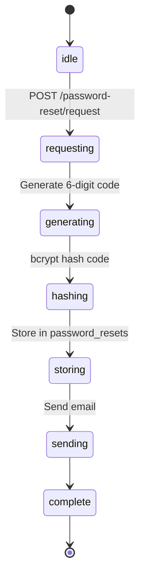
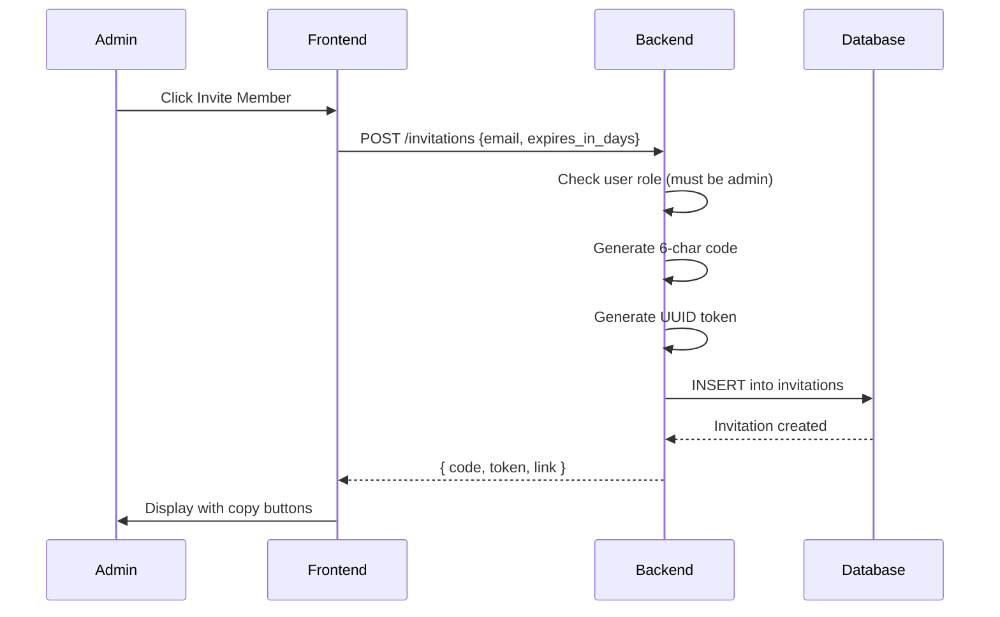
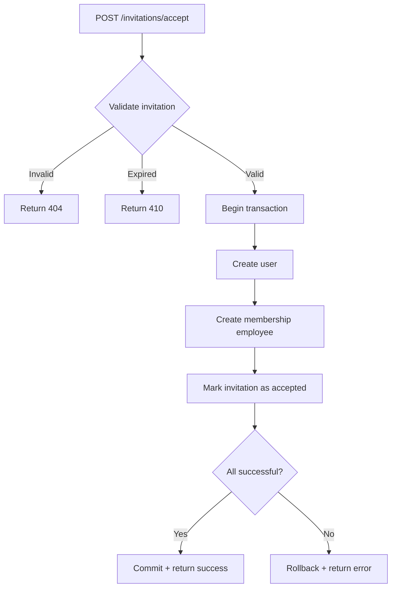

# Schema: API Contracts

## Overview
Complete API specification for authentication and invitation endpoints. All responses follow the standard envelope format: `{ data, error }`.

---

## Authentication Endpoints

### POST /auth/login
Unified login with username OR email.

**Request:**
```json
{
  "identifier": "johndoe OR john@example.com",
  "password": "password123"
}
```

**Response (200 OK):**
```json
{
  "data": {
    "token": "eyJhbGciOiJIUzI1NiIsInR5cCI6IkpXVCJ9...",
    "refresh_token": "base64_encoded_refresh_token",
    "user": {
      "id": "550e8400-e29b-41d4-a716-446655440000",
      "email": "john@example.com",
      "username": "johndoe",
      "name": "John Doe",
      "role": "admin",
      "org_id": "org-uuid"
    },
    "expires_at": "2026-04-19T23:00:00Z"
  }
}
```

**Errors:**
- `401 Unauthorized` - Invalid credentials
- `400 Bad Request` - Missing identifier or password



---

### POST /auth/bootstrap
Create organization and admin user atomically. Returns JWT for auto-login.

**Request:**
```json
{
  "org_name": "Acme Corp",
  "firstname": "John",
  "lastname": "Doe",
  "username": "johndoe",
  "email": "john@example.com",
  "password": "password123"
}
```

**Response (200 OK):**
```json
{
  "data": {
    "token": "eyJhbGci...",
    "refresh_token": "base64...",
    "user": {
      "id": "user-uuid",
      "email": "john@example.com",
      "username": "johndoe",
      "name": "John Doe"
    },
    "organization": {
      "id": "org-uuid",
      "name": "Acme Corp",
      "slug": "acme-corp"
    }
  }
}
```

**Errors:**
- `409 Conflict` - Duplicate username or email
- `400 Bad Request` - Validation failed (password too short, etc.)



---

### POST /auth/register
Standard user registration (without org creation).

**Request:**
```json
{
  "email": "john@example.com",
  "username": "johndoe",
  "firstname": "John",
  "lastname": "Doe",
  "password": "password123",
  "organization_name": "Acme Corp"
}
```

**Response (200 OK):**
```json
{
  "data": {
    "message": "registration successful",
    "user": {
      "id": "user-uuid",
      "email": "john@example.com",
      "username": "johndoe"
    }
  }
}
```

---

### POST /auth/password-reset/request
Request a password reset code.

**Request:**
```json
{
  "identifier": "john@example.com OR johndoe"
}
```

**Response (200 OK):**
```json
{
  "data": {
    "message": "reset code sent",
    "expires_in": 7200
  }
}
```

**Errors:**
- `429 Too Many Requests` - Rate limit exceeded (max 3/hour)
- `404 Not Found` - User not found (but still returns 200 for security)



---

### POST /auth/password-reset/verify
Verify reset code and set new password.

**Request:**
```json
{
  "identifier": "john@example.com OR johndoe",
  "code": "123456",
  "password": "newpassword123"
}
```

**Response (200 OK):**
```json
{
  "data": {
    "message": "password updated successfully"
  }
}
```

**Errors:**
- `400 Bad Request` - Invalid code format or password too short
- `410 Gone` - Code expired
- `409 Conflict` - Code already used

---

## Invitation Endpoints

### POST /invitations
Create a new invitation (admin/manager only).

**Headers:**
```
Authorization: Bearer <JWT>
```

**Request:**
```json
{
  "organization_id": "org-uuid",
  "email": "invitee@example.com",
  "expires_in_days": 7
}
```

**Response (200 OK):**
```json
{
  "data": {
    "id": "invitation-uuid",
    "code": "ABC123",
    "token": "550e8400-e29b-41d4-a716-446655440000",
    "link": "https://app.example.com/invite/550e8400-e29b-41d4-a716-446655440000",
    "email": "invitee@example.com",
    "status": "pending",
    "expires_at": "2026-04-26T22:00:00Z",
    "organization_id": "org-uuid"
  }
}
```

**Errors:**
- `403 Forbidden` - Non-admin attempting to create invitation
- `400 Bad Request` - Invalid email format



---

### GET /invitations/validate/code/:code
Validate an invitation by its 6-character code.

**Response (valid - 200 OK):**
```json
{
  "data": {
    "id": "invitation-uuid",
    "code": "ABC123",
    "email": "invitee@example.com",
    "status": "pending",
    "expires_at": "2026-04-26T22:00:00Z",
    "organization_id": "org-uuid",
    "organization_name": "Acme Corp"
  }
}
```

**Response (expired - 410 Gone):**
```json
{
  "error": "invitation has expired"
}
```

**Response (not found - 404 Not Found):**
```json
{
  "error": "invitation not found"
}
```

---

### GET /invitations/validate/token/:token
Validate an invitation by its UUID token (for email links).

**Response:** Same format as code validation.

---

### POST /invitations/accept
Accept an invitation and create user account.

**Request:**
```json
{
  "token": "550e8400-e29b-41d4-a716-446655440000 OR ABC123",
  "email": "newuser@example.com",
  "username": "newuser",
  "password": "password123"
}
```

**Response (200 OK):**
```json
{
  "data": {
    "message": "invitation accepted",
    "user": {
      "id": "user-uuid",
      "email": "newuser@example.com",
      "username": "newuser"
    },
    "organization": {
      "id": "org-uuid",
      "name": "Acme Corp"
    }
  }
}
```

**Errors:**
- `410 Gone` - Invitation expired
- `409 Conflict` - Email or username already exists
- `404 Not Found` - Invalid token/code



---

## Response Format Standards

All endpoints return JSON with this structure:

**Success:**
```json
{
  "data": { ... },
  "error": null
}
```

**Error:**
```json
{
  "data": null,
  "error": "error message"
}
```

**HTTP Status Codes:**
- `200 OK` - Success
- `400 Bad Request` - Validation error
- `401 Unauthorized` - Invalid/missing credentials
- `403 Forbidden` - Insufficient permissions
- `404 Not Found` - Resource not found
- `409 Conflict` - Duplicate resource
- `410 Gone` - Resource expired
- `429 Too Many Requests` - Rate limit exceeded
- `500 Internal Server Error` - Server error

---

## Related Schema Docs
- [[S01-Database-ERD]] - Database tables and relationships
- [[S02-Domain-Models]] - Domain entities
- [[S05-State-Machines]] - State transitions

## Last Updated
- **PR**: #4ab2fb9, #d400192, #0ed701a, #41d8f09
- **Merged**: 2026-04-19
- **Author**: @hourglass-team
