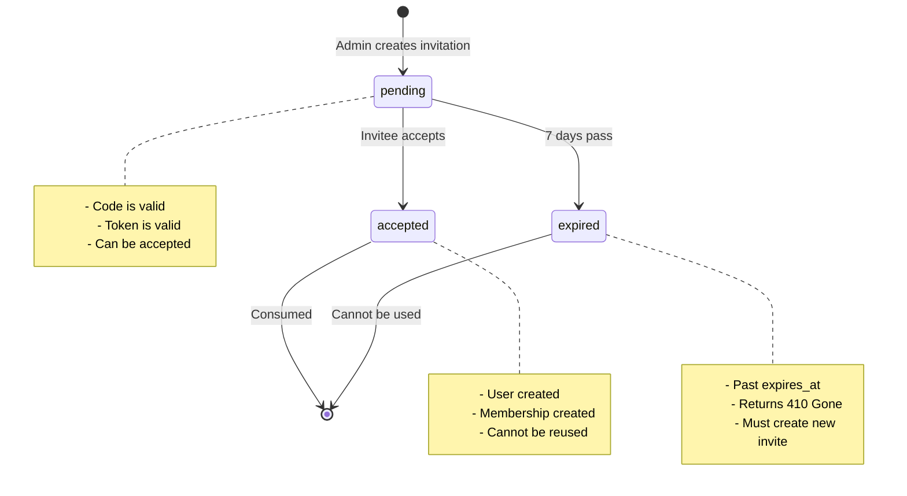
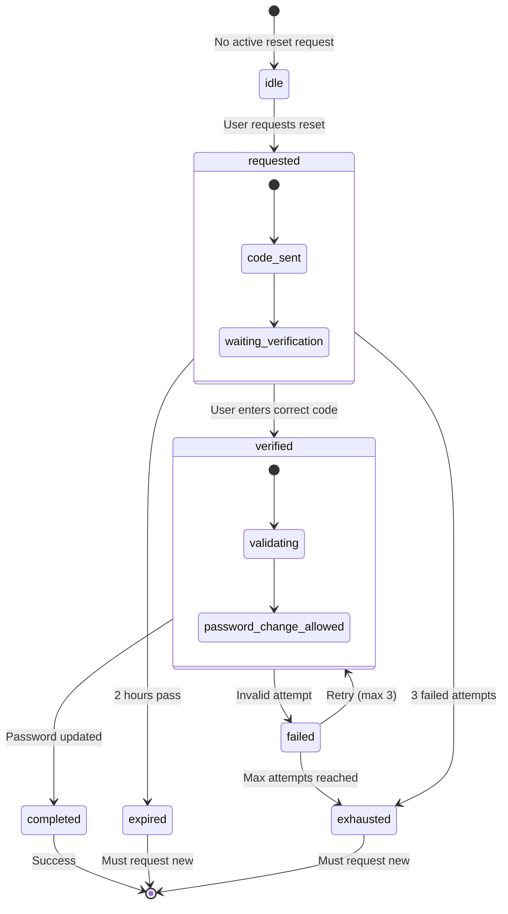
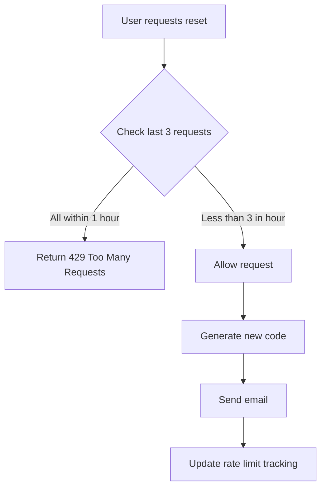
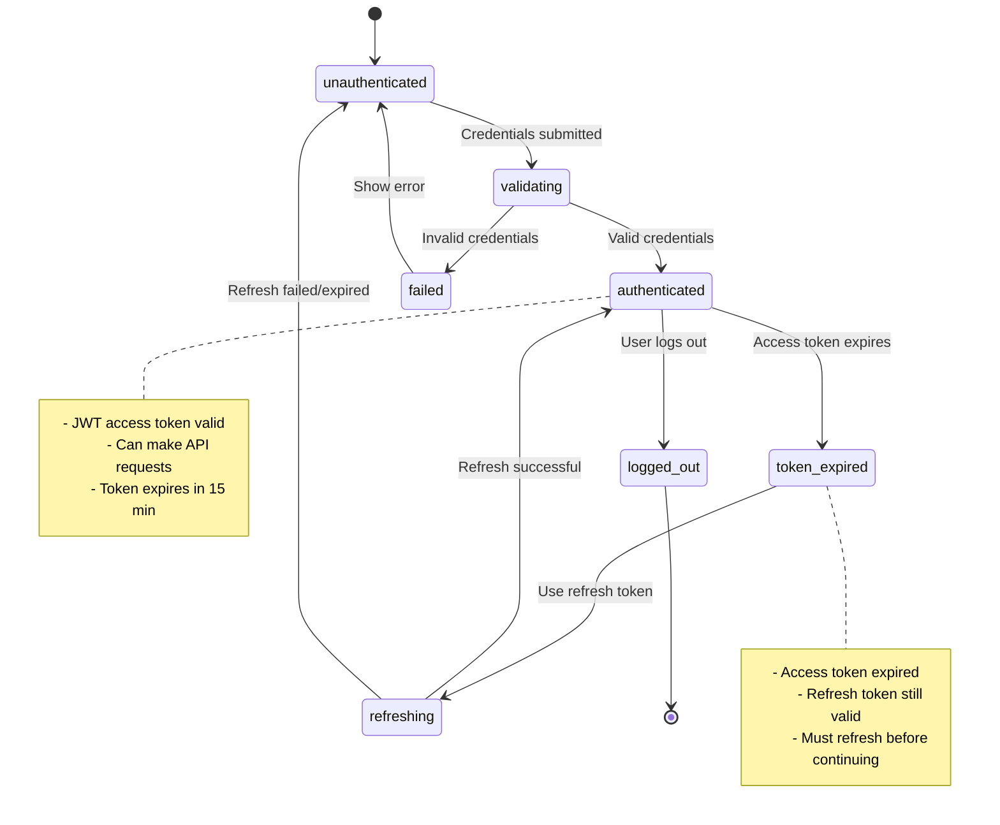
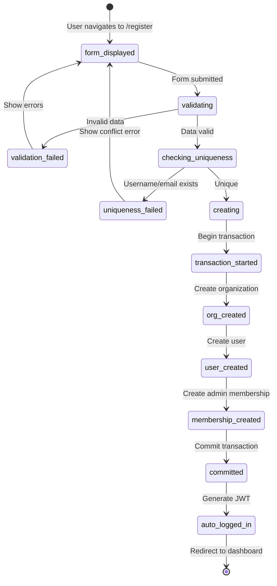
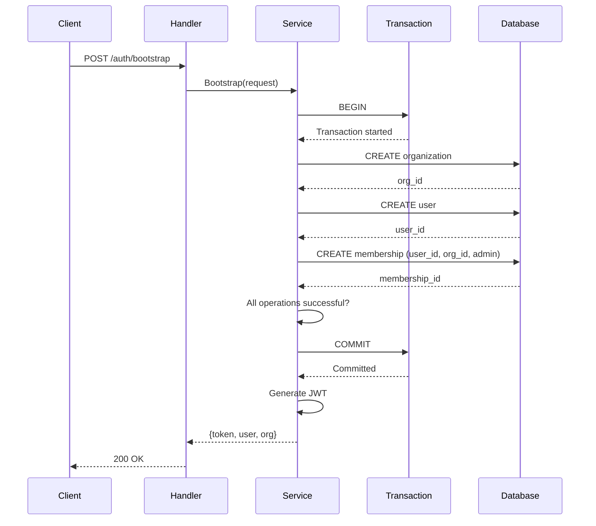
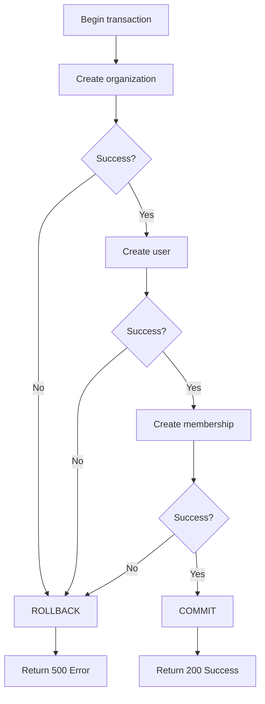
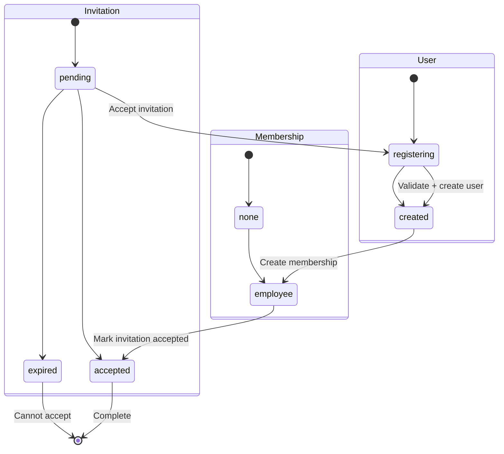

# Schema: State Machines

## Overview
State machines and status transitions for authentication flows, invitations, and password resets.

---

## Invitation State Machine

### States

### State Transitions

| From | To | Trigger | Guard Condition | Action |
|------|----|---------|-----------------|--------|
| `[*]` | `pending` | Admin creates | User is admin | Generate code + token |
| `pending` | `accepted` | Invitee accepts | Not expired + Status=pending | Create user + membership |
| `pending` | `expired` | Time passes | `now() > expires_at` | Mark as expired |
| `accepted` | `[*]` | Complete | Always | None (terminal) |
| `expired` | `[*]` | Complete | Always | None (terminal) |

### Business Rules
- **Invariant 1:** Only one active invitation per email at a time
- **Invariant 2:** Codes are case-insensitive but stored uppercase
- **Invariant 3:** Once accepted, invitation cannot be modified
- **Guard:** Accept fails if `status != pending` or `now() > expires_at`

---

## Password Reset State Machine

### States

### State Transitions

| From | To | Trigger | Guard Condition | Action |
|------|----|---------|-----------------|--------|
| `idle` | `requested` | POST /password-reset/request | Rate limit OK | Generate 6-digit code, send email |
| `requested` | `verified` | POST /password-reset/verify | Code matches + not expired | Allow password change |
| `requested` | `expired` | Time passes | `now() > expires_at` | Invalidate code |
| `requested` | `exhausted` | Failed attempts | `attempts >= 3` | Lock reset request |
| `verified` | `completed` | Valid password submitted | Password meets requirements | Update password, mark code used |
| `verified` | `failed` | Invalid code entered | `attempts < 3` | Increment attempt counter |
| `failed` | `exhausted` | Max attempts | `attempts >= 3` | Invalidate code |
| `completed` | `[*]` | Success | Always | Redirect to login |

### Business Rules
- **Invariant 1:** Only one active reset per user at a time
- **Invariant 2:** Codes expire after exactly 2 hours
- **Invariant 3:** Maximum 3 verification attempts per code
- **Invariant 4:** Used codes are marked and cannot be reused
- **Rate Limit:** Max 3 reset requests per hour per user
- **Guard:** Verification fails if `used_at != nil` or `now() > expires_at`

### Rate Limiting Logic

---

## User Authentication State Machine

### Login Flow States

### Registration State Machine

---

## Organization Bootstrap Transaction

### Atomic Operation Flow

### Rollback Scenarios

**Rollback Triggers:**
1. Organization creation fails (duplicate slug)
2. User creation fails (duplicate username/email)
3. Membership creation fails (foreign key violation)
4. Any database constraint violation

---

## Invitation Acceptance Flow

### Combined State Machine

---

## Related Schema Docs
- [[S01-Database-ERD]] - Database tables that store states
- [[S02-Domain-Models]] - Entities with state fields
- [[S04-API-Contracts]] - Endpoints that trigger transitions

## Last Updated
- **PR**: #0ed701a, #41d8f09, #d400192
- **Merged**: 2026-04-19
- **Author**: @hourglass-team
