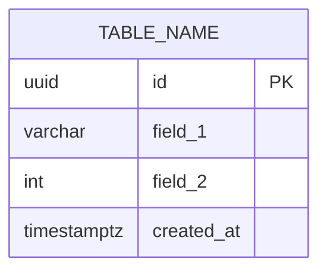
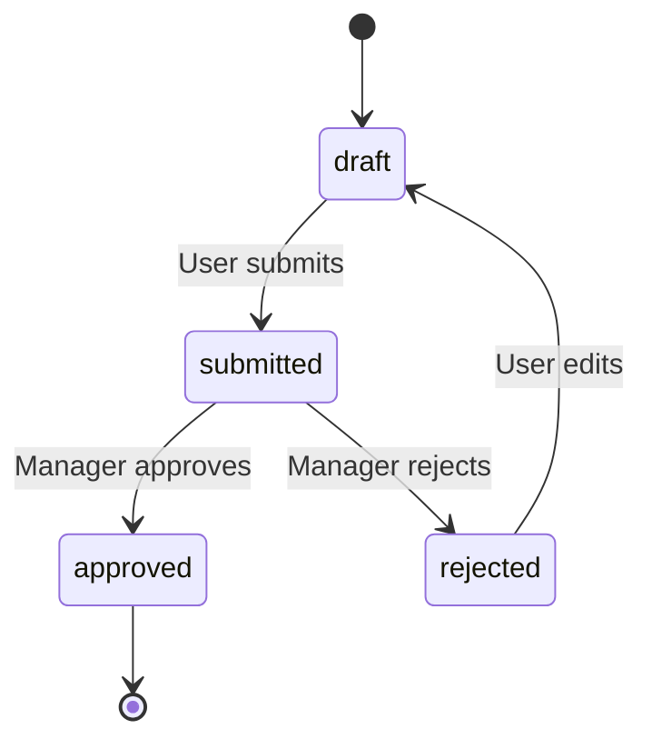
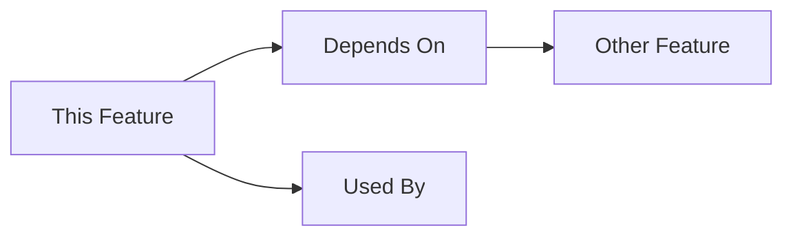

# Schema: [Domain Area]

## Domain Models

### Entity: [Name]
```go
type Entity struct {
    ID        uuid.UUID
    Field1    string
    Field2    int
    CreatedAt time.Time
}
```

**Business Rules:**
- Rule 1: Description
- Rule 2: Description

### Value Object: [Name]
```go
type ValueObject struct {
    field string
}
```

**Validation:**
- Constraint 1
- Constraint 2

## Database Schema

### Table: `[table_name]`


| Column | Type | Constraints | Description |
|--------|------|-------------|-------------|
| id | UUID | PRIMARY KEY | Unique identifier |
| field_1 | VARCHAR | NOT NULL | Description |

**Indexes:**
- `idx_table_field` - Purpose

**Foreign Keys:**
- `field_id` → `other_table(id)`

### Migration
```sql
-- migrations/009_new_feature.up.sql
CREATE TABLE table_name (
    id UUID PRIMARY KEY DEFAULT gen_random_uuid(),
    field_1 VARCHAR NOT NULL
);

CREATE INDEX idx_table_field_1 ON table_name(field_1);
```

## API Contracts

### Request/Response

#### `POST /api/endpoint`
**Request:**
```json
{
  "field": "value"
}
```

**Response (200 OK):**
```json
{
  "data": {
    "id": "uuid",
    "field": "value"
  }
}
```

**Errors:**
- `400 Bad Request` - Validation failed
- `409 Conflict` - Duplicate resource

## State Machine

### Status Transitions


**States:**
- `draft` - Initial state
- `submitted` - Pending approval
- `approved` - Final approved state
- `rejected` - Rejected, can be edited

## Ports & Interfaces (Hexagonal)

### Port: `[InterfaceName]`
```go
type InterfaceName interface {
    Method(ctx context.Context, param string) (*Entity, error)
}
```

### Implementation: `[ImplName]`
```go
type ImplName struct {
    db *sql.DB
}

func (r *ImplName) Method(ctx context.Context, param string) (*Entity, error) {
    // Implementation
}
```

## Cross-Feature Dependencies


- **Depends on:** [[S02-Domain-Models]]
- **Used by:** [[F01-Feature-Name]]

## Last Updated
- **PR**: #[number]
- **Merged**: YYYY-MM-DD
- **Author**: @username
