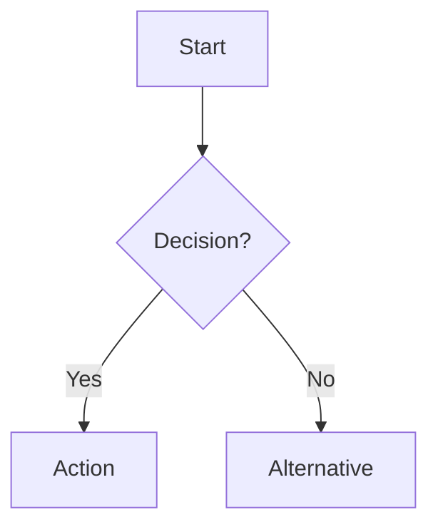

# Hourglass Documentation Vault

This is the official documentation vault for Hourglass - a time entry and expense tracking system with approval workflows.

## 📖 Structure

The documentation is organized into three main sections:

### 01-Features (User-Facing)
- User stories and workflows
- Acceptance criteria
- Mermaid diagrams showing user flows
- Written for: Product managers, developers, testers

### 02-Technical (Implementation)
- Code examples and patterns
- Architecture decisions
- Testing strategies
- Written for: Developers

### 03-Schema (Design & Contracts)
- Database schema and ERD diagrams
- Domain models and value objects
- API specifications
- State machines
- Written for: Architects, developers

## 🚀 Quick Start

### For New Developers
1. Start at [[00-Index]] - central navigation hub
2. Read [[LEGACY/01-System-Overview]] - understand the business logic
3. Read [[LEGACY/15-Development-Setup]] - set up your environment
4. Read [[T01-Hexagonal-Architecture]] - understand the architecture pattern

### For Adding Features
1. Follow the three-step documentation process:
   - **Step 1:** Feature doc in `01-Features/` (user perspective)
   - **Step 2:** Technical doc in `02-Technical/` (implementation)
   - **Step 3:** Schema doc in `03-Schema/` (design contracts)
2. Use templates: `_TEMPLATE.md` in each folder
3. Include Mermaid diagrams for all workflows
4. Run `./scripts/docs-check.sh` to verify completeness

### For Understanding Existing Code
1. Check `01-Features/` for what the feature does
2. Check `02-Technical/` for how it's implemented
3. Check `03-Schema/` for data models and API contracts
4. Check `graphify-out/GRAPH_REPORT.md` for architecture context

## 🛠️ Automation

### Generate Documentation Draft from PR
```bash
./scripts/generate-docs-draft.sh <pr-number>
```

### Check Documentation Completeness
```bash
./scripts/docs-check.sh
```

### Validate Mermaid Diagrams
```bash
./scripts/validate-mermaid.sh
```

## 📊 Standards

### Mermaid Diagrams
All workflows and state machines MUST use Mermaid syntax:



Supported diagram types:
- `flowchart` - User workflows, decision trees
- `sequenceDiagram` - API interactions
- `stateDiagram-v2` - Status transitions
- `erDiagram` - Database relationships

### Documentation Checklist
For every new feature:
- [ ] User stories with acceptance criteria
- [ ] At least one Mermaid workflow diagram
- [ ] Technical implementation details
- [ ] API endpoint specifications
- [ ] Database schema changes (if any)
- [ ] State machine (if applicable)

## 🔗 Related Resources

- **Code Repository:** Root of the project
- **Knowledge Graph:** `graphify-out/GRAPH_REPORT.md`
- **Implementation Plans:** `plans/` folder
- **AGENTS Guide:** `AGENTS.md` in root

## 📝 Obsidian Integration

This vault is optimized for Obsidian:
- Wiki-style links: `[[Document-Name]]`
- Backlinks automatically generated
- Graph view shows document connections
- Mermaid diagrams render natively

To use in Obsidian:
1. Open Obsidian
2. "Open vault" → select `hourglass-vault/`
3. Enable Mermaid plugin (Settings → Core plugins)
4. Enjoy linked knowledge base!

## 🎯 Current Status

### Completed Documentation
- ✅ Authentication system (F04, T02, S01-S05)
- ✅ Organization bootstrap (F05)
- ✅ Invitation system (F06)
- ✅ Hexagonal architecture pattern (T01)

### In Progress
- ⏳ Time Entries feature
- ⏳ Expenses feature
- ⏳ Remaining handler migrations

### Next Priority
1. Document time entry approval workflow
2. Document expense management
3. Migrate legacy architecture docs

---

**Questions?** Check `00-Index.md` for navigation or reach out to the team.

**Want to contribute?** Follow the templates and checklists in each section.
