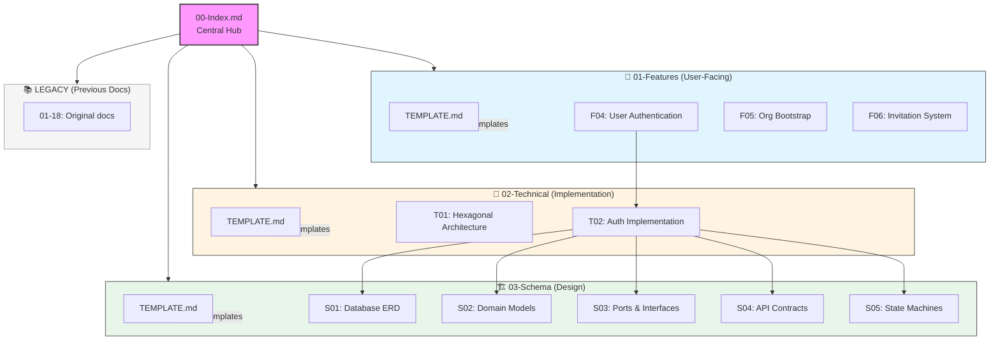
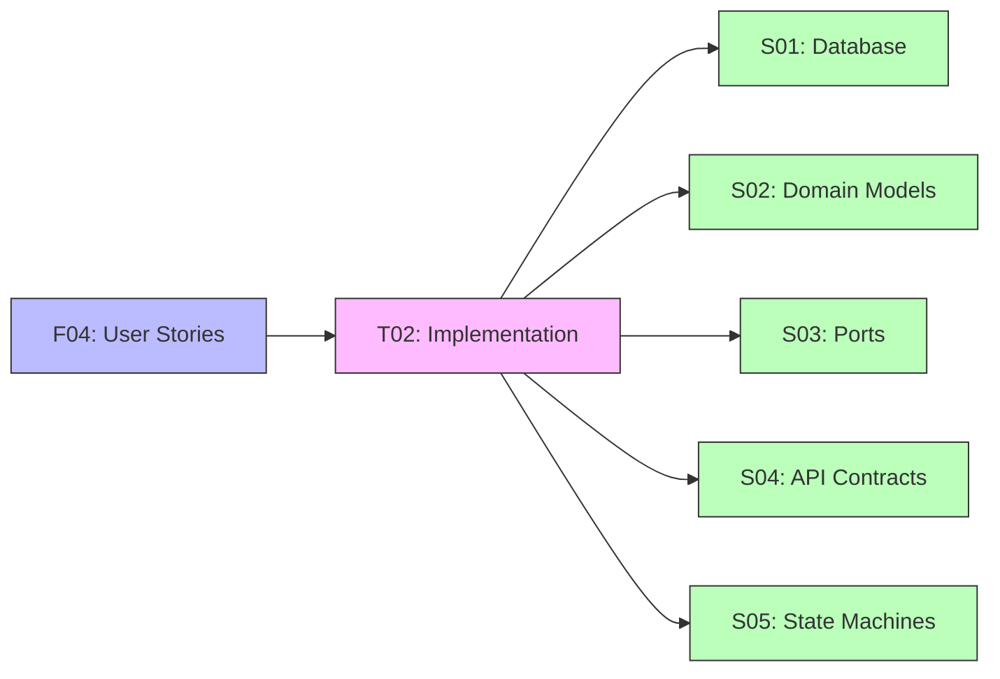
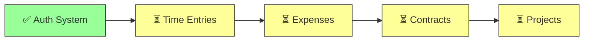
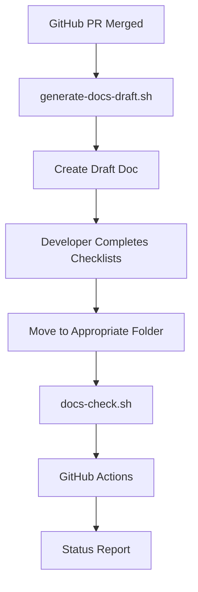

# Documentation Structure Overview

## Complete Vault Map

## Document Relationships

### Authentication System (Complete)

### Next Features to Document

## File Naming Convention

### Features
- Format: `F##-Feature-Name.md`
- Example: `F04-User-Authentication.md`
- Numbered for Obsidian sorting

### Technical
- Format: `T##-Topic-Name.md`
- Example: `T01-Hexagonal-Architecture.md`
- Numbered for Obsidian sorting

### Schema
- Format: `S##-Topic-Name.md`
- Example: `S01-Database-ERD.md`
- Numbered for Obsidian sorting

## Cross-Reference Pattern

All documents use wiki-style links:
- `[[F04-User-Authentication]]` - Link to feature
- `[[T02-Auth-Implementation]]` - Link to technical
- `[[S01-Database-ERD]]` - Link to schema

Mermaid diagrams show relationships visually.

## Automation Integration

## Quick Reference

| Need | Go To |
|------|-------|
| User workflow | `01-Features/FXX-*.md` |
| How to implement | `02-Technical/TXX-*.md` |
| Database structure | `03-Schema/S01-Database-ERD.md` |
| API spec | `03-Schema/S04-API-Contracts.md` |
| State transitions | `03-Schema/S05-State-Machines.md` |
| Architecture pattern | `02-Technical/T01-Hexagonal-Architecture.md` |

