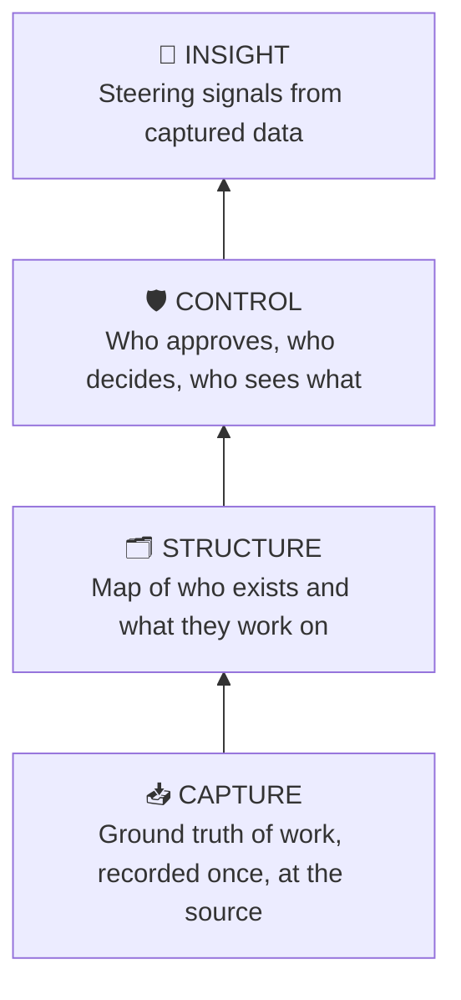

# VISION — Hourglass Product Coherence

---
tags: ["vision", "product", "coherence", "hourglass"]
date: 2026-07-28
status: draft
---

> **Purpose:** The single reference for *why* Hourglass exists and *why each feature exists*. Every feature, SPEC, and plan must trace back to this document. If an idea cannot pass the steering test below, it does not enter the roadmap.

---

## 1. The Problem This Solves

The vault documents Hourglass bottom-up: tables, endpoints, CRUD workflows. It answers "what does it do" but never "why does this feature exist". That gap between the documented app (a time & expense tracker) and the actual product (a work operations platform) is what makes uncontrolled steering possible. This document closes that gap.

## 2. Mission

**Hourglass removes the meta-work around work** — so every person knows what to do, every project knows where it stands, and every contract knows what it's worth.

## 3. The Three Questions

The entire product exists to answer three questions, at any moment, from captured data:

1. **"What should I be working on?"** — direction for people
2. **"Is the work on track?"** — steering for managers
3. **"What does the work cost and earn?"** — economics for finance

### The stakeholder map (2026-07-29)

Each edge carries only what serves the three questions; edges are scopes, not features:

| Edge | Carries | Question | Lands |
|------|---------|----------|-------|
| Employee ↔ their own work | Capture: entries/expenses on activities; Today view (V1) | Q1 | v0.1 / v0.2 |
| Management ↔ employee | Activity assignment, WG formation, manager-stage approval, knowledge profiles (V3) | Q2 | v0.1, v0.3 |
| Finance ↔ employee | Finance-stage confirmation, cutoff locks, exports | Q3 | v0.1 |
| Management ↔ Finance | Contracts (v0.1) → project-finance overview (V6), pricing projection (V5) | Q3 | v0.1 → v0.4 |
| HR ↔ staffing *data* | Curates typed absence windows + validity dates; consumes exports incl. the payroll view ([[ADR-P-008 — Availability & Employment Validity]]) | data quality for Q2/Q3 + wages | v0.1 schema |
| Customers ↔ contracted work | Read overview of their projects (customer role exists; surface unspecced) | transparency | open — ADR candidate |

**Explicitly not carried on any edge:** HR↔employee *communication* (§8 chat — the channel is data, not messages), medical documents (only the `certificate_ref` number; §8), leave *accounting* — balances, accruals, "days remaining" (§8 HR machinery; absence is captured/routed/exported, never accounted, ADR-P-008 D-1), task boards (§8; demand arrives as tickets per [[ADR-P-003 — Tickets as the Second Capture Layer]]), wiki/authored documents (knowledge here is *derived* — V3 profiles, V4 maps).

## 4. The Four Pillars

Every feature belongs to exactly one pillar. Each pillar answers the three questions using data from the pillars below it.

| Pillar | Purpose | Current features | Vision features |
|--------|---------|------------------|-----------------|
| **Capture** | Record the ground truth of work, once, at the source | Time entries, expenses, receipts | Tickets/requests (internal + external), priorities |
| **Structure** | Map who exists and what they're working on | Org hierarchy, units, working groups, projects, contracts, customers | Employee knowledge profiles, project knowledge maps |
| **Control** | Decide who approves and who sees what | Roles, approval workflows, governance models, invitations, adoption | Change requests on projects/contracts |
| **Insight** | Turn captured data into steering signals | Exports (the only current Insight feature) | Today view, dashboards, contract pricing analytics, real-time project finance |

**Key insight:** v0.1 is Capture + Structure + Control. Insight is nearly empty (exports only). That is coherent for an MVP — there is no insight without ground truth — but the vision items are not scope creep: they are the missing fourth pillar, and they must be sequenced *behind* the pillars that feed them.

## 5. Feature Purposes (Existing)

Every current feature, restated by *why it exists* — not what it does:

| Feature | Real purpose | Pillar |
|---------|--------------|--------|
| Time entries | The atomic unit of "what work actually happened" — everything else derives from this | Capture |
| Expenses | The atomic unit of "what the work cost beyond hours" | Capture |
| Org hierarchy / units | "Who is accountable for whom" — routes approvals, scopes visibility | Structure |
| Working groups | The *execution* layer over the org tree: "who actually works together right now" — distinct from units, and the future home of knowledge-based team formation | Structure |
| Projects | The container work belongs to — makes time attributable; project work may be billable or non-billable to the customer *(superseded by [[ADR-P-007 — Activity Ontology]]: recursive activities, billability on the work)* | Structure |
| Contracts | The economic boundary of work — links activities to customers and price; the source of the billability default | Structure |
| Personal & internal activities | Non-commercial work (learning, briefings, events) captured with the same fidelity as project work — approvals fall back to the unit manager ([[ADR-P-007 — Activity Ontology]] D-8) | Structure |
| Approval workflows | Converts captured time into *trusted* time — the property that makes Hourglass data usable for billing/payroll later | Control |
| Governance models (creator/unanimous/majority) | Per-project definition of whose approval counts | Control |
| Invitations / bootstrap | Controlled entry into an org's structure | Control |
| Adoption (shared contracts/projects) | Reuse of standard work definitions across orgs without duplication | Control |
| Exports | Today's primitive Insight — proof the captured data is queryable and meaningful | Insight |

### Open question surfaced by this exercise

**Units vs. working groups** is the weakest distinction in the current documentation. It survives only under this framing:

* **Units** = accountability structure (stable, approval routing, reporting lines)
* **Working groups** = execution structure (fluid, formed around work, dissolved when done)

This distinction needs an ADR. Without it, the two look redundant and one of them will quietly rot.

## 6. Vision Features, Sequenced

Each vision item with its purpose, the pillar it completes, and its hard dependencies. **Nothing here is arbitrary — the order is forced by data dependencies.**

| # | Vision item | Purpose | Depends on | Phase fit |
|---|-------------|---------|------------|-----------|
| V1 | **"Today" view / priorities** — eliminates "what am I working on?" | Insight for the individual: one screen answering "what now" from my tickets, my projects, my pending approvals | Capture ✅, Tickets (V2) | v0.2 |
| V2 | **Tickets / request tracking** (internal + external) | The missing Capture layer for *demand*: today we capture time spent but not the requests that caused it. Every request gets an owner, a status, and eventually time booked against it | v0.1 stable | v0.2 |
| V3 | **Employee knowledge at a glance** | Makes working groups *smart*: skills, current load, project history per person → team formation stops being guesswork | Structure ✅ + accumulated history | v0.3 |
| V4 | **Project knowledge maps, evolutions, change requests** | Projects stop being name+type rows: they gain living state, and scope changes become first-class Control events instead of chat messages | Tickets (V2) — change requests are a ticket type | v0.3 |
| V5 | **Contract helper / pricing analytics** | "What did similar work actually cost us?" — turns historical time+expense data into quoting intelligence | Sufficient captured history, Insight infrastructure | v0.4 |
| V6 | **Real-time project finance overlook** | Burn vs. budget per project, live — steering mid-flight instead of at invoice time | V1 dashboard infrastructure + budget fields on contracts | v0.4 |
| V7 | **Outcome knowledge capture** — "what was made / learnt / taught / shown" | Entries and activities capture *outcomes*, not just effort and cost — the ground truth of company knowledge, and the substrate V8 builds on | Activity ontology ✅ (v0.1), accumulated entry history, designed alongside V4 | v0.3+ |
| V8 | **Company knowledge wiki** — LLM/RAG/knowledge graph over captured outcomes, **inside Hourglass** | "What does the company know?" — answers grounded in captured outcome data, queryable at every level (person, activity, org); retrieval must respect the unit-subtree visibility scoping (Control) | V7 (outcome substrate) + substantial accumulated knowledge + Insight infrastructure from V5 | v0.5+ |

**Dependency chain:** Tickets → Today view → dashboards → real-time finance. History → pricing analytics. Sequence by pillar depth, never across pillars.

## 7. The Steering Test

Apply to every idea before it enters a SPEC or plan:

> A feature belongs in Hourglass **if it helps answer one of the three questions using data the platform captures** — and it belongs *now* only if the pillars below it are already in place.

Two-part test, both must pass:

1. **Belonging:** Does it serve a question, using captured (or soon-captured) data?
2. **Timing:** Are its data dependencies already captured by a lower pillar?

## 8. Explicit Out-of-Scope Anchors

These will tempt. They are rejected here, once, permanently (reopen only via a new vision revision):

* **Chat / communication** — Hourglass references work, it doesn't host conversation about work
* **Task execution** — tickets track *demand*; Hourglass is not a Jira board, sprint planner, or Kanban tool
* **Payroll / invoice issuance** — Hourglass produces *trusted data* for those systems; it does not become them
* **HR management** — org structure exists to route approvals and scope visibility, not to manage people. **Sharpened 2026-07-29:** typed absence windows (holiday/permit/medical/unavailable) and employment-validity dates *as staffing structure data* are in scope, and HR itself is in scope as **curator/consumer** via an `hr` org role, with holiday confirmation routed per [[ADR-P-008 — Availability & Employment Validity]] D-1a and a payroll **export** feeding wages. Remain out of scope: leave/absence *accounting* (balances, accruals, "days remaining"), medical/permit **documents** (only the `certificate_ref` number is stored), and **HR as an approval stage** — entry routing stays manager → finance.
* **Real-time collaboration features** — presence, live cursors, comments threads
* **Knowledge-product premature build** — the in-product LLM-wiki/RAG/knowledge graph is a **deferred roadmap item (V8)**, not v0.1–v0.4 scope: building it before V7's outcome substrate has accumulated real content would produce an empty shell, and retrieval must be designed against the visibility scoping, not bolted on

## 9. Relationship to Existing Docs

* `LEGACY/01-System-Overview` describes the *mechanics* (what exists). This document describes the *intent* (why it exists). Read this first, then mechanics.
* `01-Features/` documents should each declare their pillar and purpose at the top (template change).
* The `.planning/ROADMAP.md` phases 0–7 delivered Capture + Structure + Control. Future phases map to V1–V6 above.
* The pre-deployment audit (`research/2026-07-28 — Pre-Deployment Audit`) fixes v0.1 stability. It changes no purpose here — it secures the foundation the pillars stand on.

## 10. Revision Rules

* This document changes only through explicit revision (date + reason recorded below).
* Features may move between phases; they may not move between pillars without a vision revision.
* A new feature idea enters the roadmap only after it passes the steering test and is slotted into §6.

### Revision log

| Date | Change | Reason |
|------|--------|--------|
| 2026-07-28 | Initial draft | Coherence restructure from vault analysis |
| 2026-07-29 | Feature table: billability made explicit on project work; personal/internal activities row added | [[ADR-P-007 — Activity Ontology]] D-7/D-8 — the vision assumed billability ("usable for billing", §5) without stating where it lives; Stefano's company cases (billable/non-billable project activities, personal learning, group briefings) made both gaps concrete |
| 2026-07-29 | §8 HR anchor sharpened: availability windows + employment-validity dates in scope as staffing structure data; machinery stays out | [[ADR-P-008 — Availability & Employment Validity]] — manager's need to check availability/employability at assignment time passes §7 belonging ("is the work on track?"); leave balances and document storage do not |
| 2026-07-29 | §8 HR anchor, second carve: `hr` org role as curator/consumer of staffing data; HR-as-approval-stage explicitly rejected | Stefano: "add HR to the loop so it can get informations directly easing up its work" — HR maintaining/consuming availability + validity data (and payroll-prep exports) serves all three questions' data quality; HR approving entries would absorb the HR workflow |
| 2026-07-29 | §3 stakeholder map added; §8 third carve: absence **kinds** + holiday confirmation routing + medical `certificate_ref` + payroll export admitted; leave *accounting*, documents, and HR approval stay rejected | Stefano's stakeholder map + "wages need this too" — ferie/permessi/malattia are paid differently, so payroll needs the kind; earlier "no taxonomy" position reversed (kinds/dates are ordinary employer processing; only medical *content* is special-category). See [[ADR-P-008 — Availability & Employment Validity]] D-1/D-1a/D-1c |
| 2026-07-29 | V7 outcome knowledge capture added (§6); knowledge-product boundary added (§8) | Stefano's goal: "build a LLM-wiki/RAG/knowledge graph from what was made/learnt/taught/shown." Capture passes the steering test but not its timing clause — parked as V7, designed with V4 |
| 2026-07-29 | V8 added: the wiki is **in-product**, deferred (§6); §8 boundary revised from "external consumer" to "premature build" | Stefano's correction: the LLM-wiki/RAG/knowledge graph belongs in Hourglass's own roadmap, not outside it. §8 now defers it behind V7's substrate + visibility design instead of excluding it — the sequencing discipline is unchanged |

---

*Drafted from analysis of 00-Index, LEGACY/01-System-Overview, LEGACY/12-Contracts-Projects, F05/F06 feature docs, STRUCTURE.md, README.md, .planning/ROADMAP.md, and the v0.1 pre-deployment audit.*
