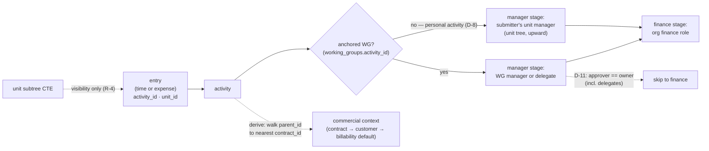

# ADR-BE-014 — Approval-Routing Precedence & Activity-Chain Resolution

---
tags: ["adr", "backend", "routing", "approvals", "visibility", "ontology"]

---

# ADR-BE-014 — Approval-Routing Precedence & Activity-Chain Resolution

**Status:** Accepted
**Date:** 2026-07-29 (accepted) · 2026-07-29 (revised: R-2 unit-manager fallback for personal activities)
**Code:** `internal/core/services/{time_entry,expense}/`, `internal/adapters/secondary/postgres/{time_entry,expense,activity,unit}_repository.go`, `migrations/`
**Encodes:** [[ADR-P-001 — Units vs Working Groups]] Q1/Q2/Q4 + `enforce_unit_tuple` removal (Q3) · [[ADR-P-007 — Activity Ontology]] D-3/D-4/D-5/D-8

---

## Context

ADR-P-001 settled the idea layer — approvals route through **execution** (WG manager/delegate), units provide **visibility scoping** (subtree gating), delegates are included in the D-11 skip, and `enforce_unit_tuple` is dropped. ADR-P-007 then revised the ontology beneath those decisions: projects+subprojects became the recursive `activities` entity, and both entry types now link through a single required `activity_id`. This ADR is the backend encoding of both, in the new ontology. It replaces the pre-ontology framing of BE-014 (which assumed `wg_id` on entries and a no-activity expense fallback — both gone).

## Decision

### R-1 — Resolution chain (single source: the activity)

Every entry (time **or** expense) resolves its routing context from its `activity_id` — never from FKs pinned on the entry:

```
entry.activity_id
  → activity's anchored working group        (working_groups.activity_id)
  → WG manager + delegates                   (the "manager" approval stage)
  → org finance role                         (the "finance" stage)
```

**Commercial chain (for pricing, customer attribution, cutoff, exports)** is derived separately by walking the activity's `parent_id` upward to the nearest ancestor with a `contract_id` (recursive CTE — the same pattern as the units subtree). Entries store no `project_id`, `subproject_id`, `wg_id`, or `customer_id`. The chain is **derived, not stored** (ADR-P-007 D-3).

### R-2 — Manager-stage approver: WG manager/delegate, unit-manager fallback for personal activities

Both entry types resolve the manager stage through **one precedence chain**:

1. The WG anchored to the entry's activity → **WG manager or a delegate** (ADR-P-001 Q1, "expenses match time", now implementable).
2. **No anchored WG** (a *personal* activity per ADR-P-007 D-8 — learning, certifications, individual research) → **the submitter's unit manager** (`unit_memberships.role = 'manager'` on the entry's `unit_id`; nearest manager walking the unit tree upward if the entry's own unit has none).

**This is a fallback to a *person*, not a hole.** The unit manager it lands on is the same principal ADR-P-001 Q2 already grants subtree *visibility* over these entries — the approver is whoever already sees the work. Self-approval remains impossible by construction (the manager is by definition a different membership row than the submitter's).

* An activity with `contract_id` set (commercial work) **must anchor a WG before it accepts entries** — enforced at submission time (service-layer validation, sentinel `ErrActivityNotLoggable` per [[ADR-BE-001 — Error Handling Sentinel Errors]]). The unit-manager fallback exists **only** for non-commercial activities where a team is not meaningful.
* Project managers (now `activity_managers`) keep their governance meaning but are **not** an approval queue, unchanged from ADR-P-001.

### R-3 — D-11 skip, delegates included

If the entry's **WG manager _or any delegate_ is the entry owner**, `submitted` transitions directly to `pending_finance` (ADR-P-001 Q4). Implementation must keep the distinction explicit: the skip fires only when the *approver role* coincides with the *owner* — **never true self-approval**. Applies identically to time entries and expenses.

### R-4 — Visibility: unit-subtree gating

List queries gate on the **unit tree**, unchanged in spirit from ADR-P-001 Q2 and orthogonal to routing:

* A unit manager (`unit_memberships.role = 'manager'`) sees entries whose `unit_id` falls in their **subtree** (recursive CTE already in the units repository). Entries carry `unit_id` (accountability pin) — this is what visibility gates on.
* Org-role `manager` / `finance` see the whole org.
* Routing (R-1/R-2) and visibility (R-4) are separate axes: the first decides *who approves*, the second *who can see*.

### R-5 — Schema consequences

* `time_entries`: **drop** `project_id`, `subproject_id`, `wg_id`; **add** `activity_id NOT NULL`. Keep `unit_id NOT NULL` (visibility pin, R-4).
* `expenses`: **drop** `project_id`, `customer_id`; **add** `activity_id NOT NULL`. Keep `unit_id NOT NULL`.
* `working_groups`: `subproject_id` → `activity_id` (anchor at any depth); **drop `enforce_unit_tuple`** (ADR-P-001 Q3 — the member-unit link is already guaranteed by `wg_members.unit_id NOT NULL`; strictness, if ever wanted, is a validation, not a dead toggle).
* `project_managers` → `activity_managers` (`activity_id`).
* `financial_cutoff_periods`: `project_id` → `activity_id`; `IsPeriodLocked` key becomes org + activity + date range.
* All of the above lands in the **big-bang ontology migration** (ADR-P-007 D-6), as new files per [[ADR-BE-004 — Database Migrations]].

### R-6 — Repository collapse

`project_repository` and `subproject_repository` collapse into one `activity_repository`. One endpoint set replaces two. Approval `ListPending` for both entry types queries through the activity → WG join (no longer: time by WG, expenses by project manager).



## Consequences

* **One approval story, now universal:** "my WG lead (or a delegate) approves — or my unit manager if the work is just mine — finance confirms." Identical chain for time and expenses; every representable state has a defined approver.
* **Personal work is cheap to record:** learning needs only an `internal` activity — no team, no scaffolding — yet captures the full information set (ADR-P-007 D-8).
* **Billability is derivable everywhere:** entry → activity → `billable` (explicit or inherited from the contract link, D-7). No flag on entries to keep in sync.
* **The pre-ontology expense-routing behavior change** (ADR-P-001: historical expenses approved by project manager) is absorbed into the ontology migration — the old rule and old schema disappear together, pre-deploy.
* ⚠️ **Submission-time validation** ("commercial activity has an anchored WG") is a new service-layer rule with a sentinel error (`ErrActivityNotLoggable`, per [[ADR-BE-001 — Error Handling Sentinel Errors]]). Non-commercial activities are exempt — that exemption *is* the personal-activity path.
* ⚠️ **Unit-manager resolution must walk upward:** if the entry's unit has no `manager` membership, resolve through the parent unit (the units recursive CTE already supports this). Terminal state (org root without manager) routes to the org-role `manager`.
* ⚠️ **Performance:** the commercial-chain walk (R-1) is a recursive CTE per lookup; index `activities(parent_id)` and `working_groups(activity_id)`. Depth is expected to be shallow (< 6); if profiling shows hot-path cost, a materialized path column is a later optimization — do not denormalize contract onto entries.
* ⚠️ **Test impact** per [[ADR-BE-009 — Testing testcontainers testify]]: integration suites seeding projects/subprojects switch to activities; routing tests cover R-2 (WG path + unit-manager fallback incl. upward walk), R-3 (skip incl. delegates, no self-approval), R-4 (subtree gating), D-7 (billability inheritance/override).

### Revision log

| Date | Change | Reason |
|------|--------|--------|
| 2026-07-29 | Accepted (R-1…R-6) | Encode ADR-P-001 routing/visibility in the new ontology |
| 2026-07-29 | R-2 revised: unit-manager fallback replaces "no fallback"; consequences updated | ADR-P-007 D-8 — personal activities have no WG by design; my original "WG required at submission" was too strict (it forced one-person teams) |

## Related

* [[ADR-P-001 — Units vs Working Groups]] (the decisions this encodes)
* [[ADR-P-007 — Activity Ontology]] (the ontology this routes through)
* [[ADR-BE-001 — Error Handling Sentinel Errors]], [[ADR-BE-004 — Database Migrations]], [[ADR-BE-009 — Testing testcontainers testify]]
* [[research/2026-07-28 — Work Ontology — Full Picture & Revision Proposal]] (§2.6 routing diagram — superseded by R-2's no-fallback resolution)
