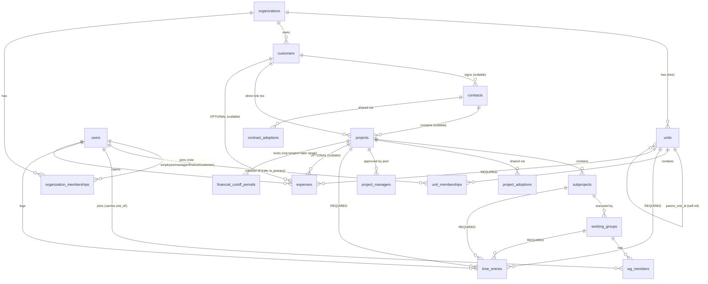
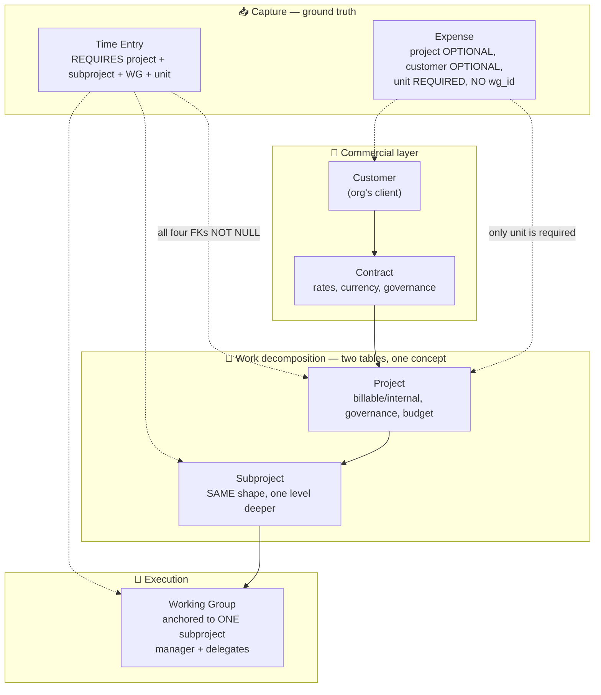
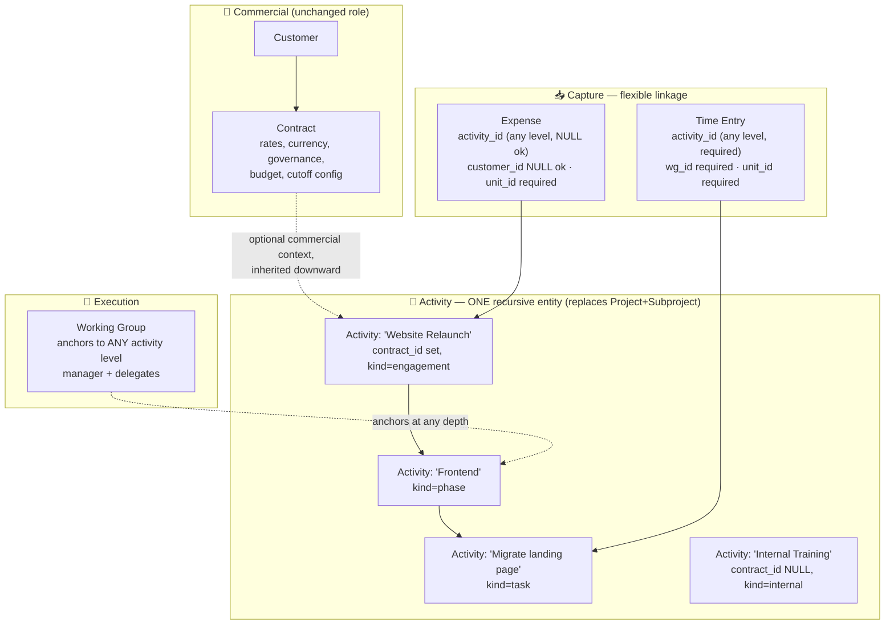
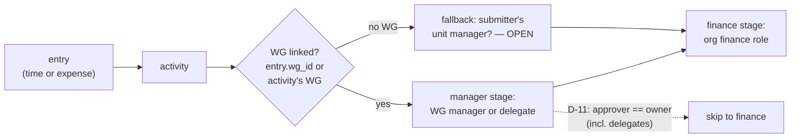

# Research: Work Ontology — Full Picture & Revision Proposal

---
tags: ["research", "ontology", "architecture", "hourglass"]
date: 2026-07-28
status: decided 2026-07-29 — codified in ADR-P-007 + ADR-BE-014
---

> **Context:** Follows the acceptance of [[ADR-P-001 — Units vs Working Groups]] (units=accountability / WGs=execution, expense routing matches time entries, subtree visibility, D-11 skip incl. delegates, drop `enforce_unit_tuple`). While drafting the backend routing ADR, two ontology questions surfaced: (a) expenses have no `wg_id` — only nullable `project_id` and `customer_id` — so "expenses match time entries" can't be a pure query rewrite; (b) Stefano: *"expenses are usually related to customers, it would be better to relate them to projects for fine-grained information"* and *"maybe we were too strict with projects too, an employee can work on activities and projects are activities — we may need a better ontology."*
>
> **This file:** paints the *actual* current architecture, then proposes an ontology revision. Nothing here is decided yet.

---

## Part 1 — The Actual Architecture (as built today)

### 1.1 The entity map



### 1.2 The rigid capture chain — where the strictness bites



**To log one hour today, an employee needs this entire chain to exist:**

```
Customer → Contract → Project → Subproject → WorkingGroup → then the entry (which also pins their unit)
```

Every link except `Customer→Contract` is effectively mandatory in practice (`project_id`, `subproject_id`, `wg_id`, `unit_id` are all `NOT NULL` on `time_entries`).

### 1.3 The five ontology problems

| # | Problem | Evidence in code/schema | Pain |
|---|---------|------------------------|------|
| O1 | **Project and Subproject are the same concept at two depths** | Both have name, description, governance_model, created_by_org_id, is_shared, adoption tables, is_active. Two tables, two repos, two endpoint sets for one idea. | Why exactly two levels? Work that needs three levels (engagement → phase → task) can't be modeled. Work that needs one level still must invent a subproject. |
| O2 | **Capture chain is fully rigid** | `time_entries`: project, subproject, wg, unit all `NOT NULL`. | "2h helping a colleague", "internal training", "pre-sales call" — any work without the full commercial chain requires fake scaffolding to log. |
| O3 | **Time and expenses capture asymmetrically** | Time: all four FKs required. Expense: `project_id` NULL-able, `customer_id` NULL-able, **no `wg_id` at all**, `unit_id` required. | Same work, two different linkage rules. The accepted ADR-P-001 decision ("expenses route like time") is blocked: expenses can't route by WG manager — there is no WG on an expense. |
| O4 | **WG anchored to the deepest level (subproject)** | `working_groups.subproject_id NOT NULL`. | A team executing a project with no subprojects can't exist. Team formation is hostage to work-breakdown depth. |
| O5 | **Economic vs. work boundaries are entangled** | Contract carries `km_rate`/currency (economics) AND is the parent of projects (work). Project has `budget_amount`. Cutoff periods lock by `org + project + date range`. | "What is this work worth?" (contract question) and "what work exists?" (activity question) are forced into one hierarchy. |

### 1.4 What already works (don't break)

* **Units = accountability tree** with `unit_memberships.role` + `is_primary` + recursive CTE — the ADR-P-001 visibility/routing decisions slot in cleanly.
* **WG manager/delegate approval pool** — the routing target ADR-P-001 chose.
* **Financial cutoff periods** as the finance-stage lock mechanism (currently keyed to org+project+date).
* **Adoption/sharing** pattern on contracts + projects (cross-org reuse).

---

## Part 2 — The Ontology Revision Proposal

### 2.1 Core insight

Stefano's remark — *"projects are activities"* — is the key. **Project and Subproject are one concept: a unit of work.** Make it one recursive entity and the two-depth limit, the fake scaffolding, and the double maintenance all dissolve.

Separate the three concerns the current chain mashes together:

| Concern | Question | Entity |
|---------|----------|--------|
| **Commercial** | What is the work worth, to whom? | Customer, Contract (unchanged role) |
| **Work** | What is there to do, at any granularity? | **Activity** (new — replaces Project + Subproject) |
| **Execution** | Who does it, who approves? | Working Group (re-anchored to Activity) |

### 2.2 Proposed model



### 2.3 The `activities` table (sketch)

```sql
CREATE TABLE activities (
    id              UUID PRIMARY KEY DEFAULT gen_random_uuid(),
    org_id          UUID NOT NULL REFERENCES organizations(id),
    parent_id       UUID REFERENCES activities(id) ON DELETE RESTRICT,  -- recursion
    name            VARCHAR(255) NOT NULL,
    description     TEXT,
    kind            VARCHAR(50) NOT NULL CHECK (kind IN ('engagement','phase','task','internal')),
    contract_id     UUID REFERENCES contracts(id) ON DELETE RESTRICT,    -- nullable: internal work
    customer_id     UUID REFERENCES customers(id),                        -- denormalized, derivable via contract
    governance_model VARCHAR(50) NOT NULL DEFAULT 'creator_controlled'
                    CHECK (governance_model IN ('creator_controlled','unanimous','majority')),
    created_by_org_id UUID NOT NULL REFERENCES organizations(id),
    is_shared       BOOLEAN NOT NULL DEFAULT FALSE,
    budget_amount   DECIMAL(12,2),
    is_active       BOOLEAN NOT NULL DEFAULT TRUE,
    created_at      TIMESTAMPTZ NOT NULL DEFAULT NOW(),
    updated_at      TIMESTAMPTZ NOT NULL DEFAULT NOW()
);
-- activity_adoptions mirrors project_adoptions (sharing preserved)
-- working_groups.activity_id replaces subproject_id (anchor at any level)
-- financial_cutoff_periods.activity_id replaces project_id
```

### 2.4 What each entity becomes

| Current | Becomes | Notes |
|---------|---------|-------|
| `projects` | `activities` (top-level: `kind='engagement'`) | keeps contract_id, budget, governance, sharing |
| `subprojects` | `activities` (children) | `parent_id` set; same table |
| `project_adoptions` | `activity_adoptions` | sharing model preserved |
| `project_managers` | stays, references activity | governance meaning unchanged (see ADR-P-001: not an approval queue) |
| `working_groups.subproject_id` | `working_groups.activity_id` | anchor at **any** depth → fixes O4 |
| `time_entries.project_id + subproject_id` | `time_entries.activity_id` | one FK; **chain optional** → fixes O2 |
| `expenses.project_id` | `expenses.activity_id` (nullable) | fine-grained work link Stefano asked for → fixes O3 |
| `expenses.customer_id` | keep, nullable | for customer costs with no activity yet (pre-sales dinner) |
| `financial_cutoff_periods.project_id` | `.activity_id` | locks at any level |

### 2.5 How this resolves each problem

* **O1 (two depths)** → one recursive entity, arbitrary depth, one repo, one endpoint set. Depth becomes data, not schema.
* **O2 (rigid chain)** → an entry references ONE activity. "Internal training" is an `internal` activity with no contract — no fake commercial scaffolding. Finer time-keeping = point at a deeper activity; the chain upward is derived, not stored.
* **O3 (asymmetry)** → both entry types link to activity the same way. Expense gains optional `activity_id` (fine-grained when known) and keeps optional `customer_id` (when it's purely commercial). Unblocks ADR-P-001's "expenses route like time": routing resolves through the expense's activity → its WG (or the submitter's WG for that activity — a decision BE-014 must make precise).
* **O4 (WG at deepest level)** → WG anchors to any activity: a project-level team, a phase-level squad, whatever the work needs.
* **O5 (entangled boundaries)** → contract is *only* economics (rates, currency, budget, cutoff config, customer); activity is *only* work. They relate, they don't contain each other.

### 2.6 Approval routing in the new model (feeds BE-014)



**Open sub-question for BE-014:** when an expense has no `activity_id` (pure customer expense), who is the manager-stage approver? Options: (a) require activity on expenses too (strictest, symmetric), (b) fall back to submitter's unit manager, (c) route straight to finance.

### 2.7 What changes for the vision pillars

| Pillar | Effect |
|--------|--------|
| Capture | Entries get *easier* to create (one activity ref instead of a 4-FK chain) — directly serves "remove meta-work" |
| Structure | Work decomposition becomes honest: arbitrary depth, internal work is first-class |
| Control | Routing resolves through one activity chain instead of three separate FKs; D-11 skip unchanged in spirit |
| Insight | V5 (pricing analytics) gets *better*: cost/price of "similar projects" = compare activities by kind/contract/customer with real depth, not the flattened two-level model |

---

## Part 3 — Open Questions → **DECIDED 2026-07-29**

| # | Question | Decision |
|---|----------|----------|
| 1 | Naming | **`activity`** (`activities` table). "Project" survives only in the `activity_managers` governance role name. |
| 2 | `kind` taxonomy | **Free catalog** (`activity_kinds`, org-extensible, seeded `engagement/phase/task/internal`) with **no level semantics**. Recursion kept as *capability* — `parent_id` nullable, nesting optional, depth is data. |
| 3 | Expense linkage | **Activity required on both entry types.** Internal work is a first-class `internal` activity → no-activity state unrepresentable → no approval fallback needed. `expenses.customer_id` dropped (derived via contract). |
| 4 | Migration | **Big-bang** — one migration replacing projects/subprojects, rewriting FKs, dropping `enforce_unit_tuple`. Trivial at MVP seed volume. |
| 5 | Timing | **This IS the v0.1 ontology** — revision lands before first deploy; no rigid-chain release. |

Codified in: [[ADR-P-007 — Activity Ontology]] (D-1…D-6) · ADR-BE-014 — Approval-Routing Precedence & Activity-Chain Resolution (R-1…R-6) · rows updated in [[ADR-P-002 — Four Pillars & Feature Purposes]].

<details><summary>Original open questions (superseded)</summary>

1. **Naming:** `activity` vs `work_item` vs keep `project` as the table name with recursion? (Domain language matters — this is the word employees will see.)
2. **`kind` taxonomy:** `engagement / phase / task / internal` — right set? Or free depth with no kind labels (depth is purely positional)?
3. **Expense linkage strictness:** activity optional or required on expenses? (See 2.6 — this decides the no-activity approval fallback.)
4. **Migration strategy:** (a) big-bang: new `activities` table + migrate projects/subprojects data + rewrite FKs; (b) expand-in-place: make `subprojects.parent_id` polymorphic... (a) is cleaner; (b) is uglier but incremental. Data volume is low (MVP seed), so (a) is realistic.
5. **Timing:** this is a v0.2+ ontology revision — do we deploy v0.1 as-is first (rigid chain, known workarounds), or revise the ontology *before* first deploy since migrating live customer data later is worse?

</details>

## Part 4 — If accepted, the follow-on artifacts

1. **ADR-P-007 — Activity Ontology** (idea layer: work is recursive, commercial ≠ work, capture links flexibly)
2. **ADR-BE-014 — Approval-Routing Precedence & Visibility** (updated: routing resolves via activity chain; subtree visibility per ADR-P-001; D-11 skip incl. delegates; expense no-activity fallback per Q3)
3. **Schema migration** — `activities` table, FK rewrites, `enforce_unit_tuple` drop (already decided), data migration from projects/subprojects
4. **ADR-P-002 update** — feature purpose table: "Projects" row becomes "Activities (work decomposition)"

---

*Research compiled from `migrations/000_full_schema.up.sql` (all 24 tables), `internal/core/domain/{time_entry,expense,working_group}/`, `internal/adapters/secondary/postgres/{time_entry,expense}_repository.go` (incl. `IsPeriodLocked`), `internal/core/services/{time_entry,expense}/`, and the accepted [[ADR-P-001 — Units vs Working Groups]].*
